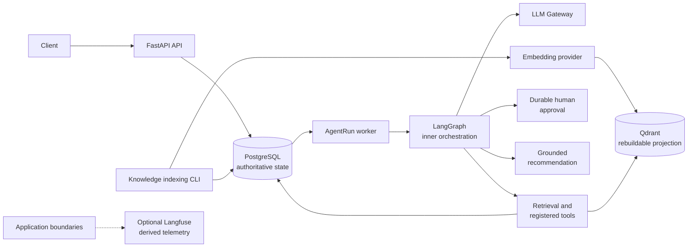

# SupportOps AI Platform

A production-minded support operations backend combining durable workflow execution, controlled LLM orchestration, retrieval, human approval, observability, and evidence-driven evaluation.

Release candidate for the defined engineering scope. The implemented system includes durable ticket processing, controlled AI workflows, retrieval, human approval, observability, deterministic evaluation, and prompt-release governance. Prompt version 2 remains an evaluated but non-adopted candidate after an inconclusive static comparison.

## Architecture at a glance



Authority boundaries:

- **PostgreSQL** is the authoritative transactional business-state store.
- **Qdrant** is a rebuildable retrieval projection.
- **AgentRun** is the outer durable execution boundary.
- **LangGraph** is the bounded inner orchestration layer.
- LangGraph checkpoints provide workflow continuity but are not the business audit ledger.
- **Langfuse** is optional derived telemetry, not an audit ledger or release authority.

## End-to-end workflow

1. A workspace-scoped support ticket is accepted.
2. The Ticket and initial AgentRun are committed atomically.
3. A worker claims the AgentRun using a lease and fencing token.
4. LangGraph executes inside the durable AgentRun boundary.
5. The ticket is classified through the application-owned LLM Gateway.
6. Active runbook evidence is retrieved from Qdrant and hydrated from PostgreSQL.
7. Registered read-only tools may execute under bounded policy.
8. Sensitive escalation pauses for durable human approval.
9. The workflow resumes after approval, rejection, or expiry.
10. A grounded recommendation with stable citations is persisted.
11. Durable records remain authoritative while Langfuse receives optional telemetry.
12. Offline evaluation produces reproducible evidence and explicit prompt decisions.

The system does not claim autonomous ticket resolution, real external escalation, exactly-once processing, or secure public multi-tenancy.

## Key engineering capabilities

### Backend reliability

- PostgreSQL-backed Ticket and AgentRun durability
- Atomic ticket and initial-run creation
- `FOR UPDATE SKIP LOCKED` claiming
- Leases and fencing tokens
- Bounded retries and stale ownership recovery
- At-least-once execution semantics with idempotent durable boundaries

### AI reliability

- Application-owned LLM Gateway
- Mock and OpenAI providers
- Structured Outputs with validated schemas
- Immutable, explicitly versioned prompts
- Durable LLM invocations with token and estimated-cost accounting

### Knowledge and retrieval

- Immutable knowledge document versions
- Deterministic chunking
- Mock and OpenAI embeddings
- PostgreSQL-owned document and chunk state
- Qdrant derived projections with stable citation hydration

### Controlled orchestration

- AgentRun as outer execution boundary
- LangGraph as inner orchestration
- PostgreSQL graph checkpoints
- Registered read-only tools with durable tool-call audit records

### Human approval

- Durable approval requests with interrupt and resume
- Expiry and rejection handling
- Execution grants and idempotent sensitive escalation
- No external side-effect integration

### Observability

- Application-owned abstraction with optional Langfuse adapter
- Privacy-aware metadata and fail-open telemetry
- Durable state remains authoritative

### Evaluation

- Deterministic regression evaluation
- Grounded recommendation evaluation with RAGAS integration
- Static paired prompt fixtures
- Safety-first release decisions
- Explicit separation between evaluation and runtime adoption

### Engineering workflow

- Alembic migrations, unit and integration tests
- Ruff, mypy, Docker, and CI
- ADRs and architecture documents

## Reliability model

PostgreSQL owns authoritative business state. The worker processes AgentRuns with at least once semantics using leases, fencing tokens, bounded retries, and stale-ownership recovery. Exactly-once execution is not claimed. Idempotency is applied at durable persistence boundaries where implemented. Optional Langfuse telemetry is fail-open and never overrides durable records. Qdrant projections are rebuildable from PostgreSQL.

Details: [AgentRun scheduling](docs/architecture/agent-run-scheduling.md), [runtime topology](docs/architecture/runtime-topology.md), [ADR 0002](docs/decisions/0002-use-postgresql-as-the-source-of-truth.md), [ADR 0004](docs/decisions/0004-use-a-postgresql-backed-worker-model.md).

## AI safety and control model

LLM calls are mediated by the application-owned Gateway. Prompts are immutable and explicitly versioned. Structured outputs are validated. Tools are registered, bounded, and currently read-only. Sensitive escalation requires durable human approval before grant-gated execution. Static evaluation evidence cannot automatically change runtime behavior; prompt adoption requires a separate explicit decision. No autonomous external write integration is available. The system is a controlled support workflow, not a fully autonomous agent.

## Evaluation outcome

Prompt version 1 remains the runtime default. Prompt version 2 is an immutable evaluation candidate.

Committed static paired fixtures exercise comparison, provenance, safety-gate, and decision behavior. The decision outcome is **inconclusive**. The run status is **incomplete**. `approved_for_runtime_adoption` is **false**. `separate_runtime_adoption_required` is **true**. Static evidence cannot authorize runtime adoption. No provider-backed superiority is claimed.

A safe non-promotion outcome demonstrates working release governance rather than failed implementation.

Evidence:

- [Classification evaluation](docs/architecture/classification-evaluation.md)
- [Evaluation and regression](docs/architecture/evaluation-and-regression.md)
- [Static comparison artifact](evals/ticket-classification/comparisons/ticket-classification-prompt-v1-v2.static.json)
- [Static decision artifact](evals/ticket-classification/decisions/ticket-classification-prompt-v2-decision.static.json)
- [ADR 0014](docs/decisions/0014-use-repository-owned-evaluation-and-evidence-driven-prompt-promotion.md)

## Quick start

Mock LLM and embedding providers are the default local path (see [`.env.example`](.env.example)).

```powershell
uv sync --frozen --all-groups
Copy-Item .env.example .env
docker compose up -d
uv run alembic upgrade head
```

Ensure the Qdrant knowledge collection before indexing:

```powershell
uv run supportops-index-knowledge ensure-collection
```

Start the API:

```powershell
uv run uvicorn supportops.api.main:app `
  --host 127.0.0.1 `
  --port 8000
```

Start the worker in a separate terminal. The worker initializes LangGraph checkpoint tables on startup:

```powershell
$env:SUPPORTOPS_WORKER_ID="worker-local-1"
uv run supportops-worker
```

Full setup, troubleshooting, and indexing details: [Local setup](docs/development/local-setup.md).

## End-to-end demonstration

A dedicated demonstration walkthrough will be added in a later documentation commit. Until then, use [Local setup](docs/development/local-setup.md) and [API examples](docs/development/api-examples.md) to:

- create a workspace;
- create and index a synthetic runbook;
- activate a document version;
- create a synthetic support ticket;
- inspect AgentRun processing;
- inspect classification, retrieval, tool calls, approval, escalation, recommendation, and evaluation evidence.

Approval and escalation HTTP contracts: [Approval workflow API](docs/development/approval-workflow-api.md).

## Repository map

```text
.
├── alembic/                         # Application schema migrations
├── artifacts/                       # Generated evaluation outputs (gitignored)
├── docs/
│   ├── architecture/                # System design and boundaries
│   ├── decisions/                   # Architecture decision records
│   └── development/                 # Local setup, API examples, testing
├── evals/                           # Committed evaluation fixtures and evidence
├── src/supportops/
│   ├── api/                         # FastAPI application and health
│   ├── agent_graph/                 # LangGraph inner orchestration
│   ├── agent_tools/                 # Registered bounded tools
│   ├── ai/                          # LLM Gateway, prompts, embeddings
│   ├── evaluation/                  # Offline evaluation and release gates
│   ├── knowledge_index/             # Chunking, Qdrant projection, indexing CLI
│   ├── knowledge_retrieval/         # Active-version semantic retrieval
│   ├── modules/
│   │   ├── agent_runs/              # Durable outer execution boundary
│   │   ├── approvals/               # Human approval records and APIs
│   │   ├── knowledge_documents/     # Immutable document versions
│   │   ├── support_recommendations/ # Grounded recommendations and citations
│   │   ├── ticket_classifications/  # Durable classification records
│   │   ├── tickets/
│   │   └── workspaces/
│   ├── observability/               # Application-owned telemetry adapters
│   └── worker/                      # AgentRun worker process
└── tests/
```

## Documentation guide

### Architecture

- [Overview](docs/architecture/overview.md)
- [Runtime topology](docs/architecture/runtime-topology.md)
- [Workspace data boundary](docs/architecture/workspace-data-boundary.md)

### Reliability

- [AgentRun scheduling](docs/architecture/agent-run-scheduling.md)
- [ADR 0002 — PostgreSQL as source of truth](docs/decisions/0002-use-postgresql-as-the-source-of-truth.md)
- [ADR 0004 — PostgreSQL-backed worker](docs/decisions/0004-use-a-postgresql-backed-worker-model.md)

### AI and retrieval

- [LLM Gateway](docs/architecture/llm-gateway.md)
- [Ticket classification](docs/architecture/ticket-classification.md)
- [Knowledge documents](docs/architecture/knowledge-documents.md)
- [Knowledge indexing](docs/architecture/knowledge-indexing.md)
- [Semantic knowledge retrieval](docs/architecture/semantic-knowledge-retrieval.md)

### Orchestration and approval

- [Controlled support workflow](docs/architecture/controlled-support-workflow.md)
- [Human-approved workflow](docs/architecture/human-approved-workflow.md)
- [Approval workflow API](docs/development/approval-workflow-api.md)
- [ADR 0010 — AgentRun vs LangGraph durability](docs/decisions/0010-separate-agent-run-and-langgraph-durability.md)
- [ADR 0012 — Application-owned approvals](docs/decisions/0012-use-application-owned-approval-records-with-langgraph-interrupts.md)

### Observability

- [ADR 0005 — Observability adapter](docs/decisions/0005-keep-ai-observability-behind-an-adapter.md)
- [ADR 0013 — Optional Langfuse](docs/decisions/0013-use-optional-application-owned-langfuse-observability.md)

### Evaluation

- [Evaluation and regression](docs/architecture/evaluation-and-regression.md)
- [Classification evaluation](docs/architecture/classification-evaluation.md)
- [Ticket classification eval artifacts](evals/ticket-classification/README.md)
- [Grounded recommendation eval artifacts](evals/grounded-recommendations/README.md)
- [ADR 0014 — Evidence-driven prompt promotion](docs/decisions/0014-use-repository-owned-evaluation-and-evidence-driven-prompt-promotion.md)

### Development

- [Local setup](docs/development/local-setup.md)
- [API examples](docs/development/api-examples.md)
- [Environment variables](docs/development/environment-variables.md)
- [Testing](docs/development/testing.md)

### ADRs

- [0001 Modular monolith](docs/decisions/0001-use-a-modular-monolith.md)
- [0003 Qdrant as rebuildable index](docs/decisions/0003-use-qdrant-as-a-rebuildable-retrieval-index.md)
- [0006 Workspace-scoped data ownership](docs/decisions/0006-establish-workspace-scoped-data-ownership.md)
- [0007 Application-owned LLM Gateway](docs/decisions/0007-use-an-application-owned-llm-gateway.md)
- [0008 Explicit profiled knowledge indexing](docs/decisions/0008-use-explicit-profiled-knowledge-indexing.md)
- [0009 Hydrate retrieval from PostgreSQL](docs/decisions/0009-hydrate-retrieval-evidence-from-postgresql.md)
- [0011 Framework-owned checkpoint schema](docs/decisions/0011-treat-langgraph-checkpoints-as-framework-owned-schema.md)

## Intentional scope boundaries

These are deliberate architectural boundaries for the repository's defined focus:

- Authentication and authorization
- Secure public multi-tenant identity
- Frontend applications
- Cloud deployment and infrastructure as code
- Real Jira, ServiceNow, Slack, or email writes
- Scheduled or online evaluation
- Production feedback ingestion
- Canonical paid-provider prompt benchmark
- Runtime adoption of prompt version 2
- External RAGAS baseline as canonical evidence
- Langfuse datasets and experiments
- Redis, Celery, Kafka, or SQS
- General OpenTelemetry and metrics stack
- Cross-provider fallback

Workspace scoping demonstrates data-ownership boundaries. It is not secure authenticated public multi-tenancy.

## Project status

The defined backend and AI systems scope is feature-complete. Documentation and release-readiness work is in progress on the current branch. Prompt version 1 remains runtime-adopted. Prompt version 2 remains non-adopted. The repository does not claim production deployment maturity or a stable public 1.0 API.

## License

No open-source license has been selected for this repository.
