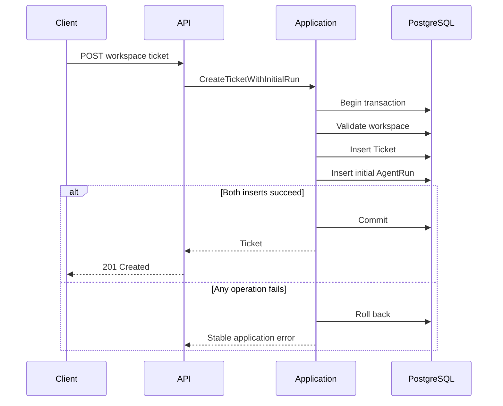

# Transactional AgentRun Scheduling

## Purpose

SupportOps AI Platform creates a durable processing record whenever a support
ticket is accepted.

The ticket and its initial `AgentRun` are persisted in the same PostgreSQL
transaction. This guarantees that a committed ticket always has a durable
processing reference and prevents work from being scheduled independently of
the business record it belongs to.

This document focuses on transactional scheduling and the handoff boundary to
worker processing. Runtime process topology and worker operations are detailed
in [`runtime-topology.md`](runtime-topology.md). The internal design of the
default controlled workflow is detailed in
[`controlled-support-workflow.md`](controlled-support-workflow.md), and the
separation of outer and inner durability is recorded in
[`../decisions/0010-separate-agent-run-and-langgraph-durability.md`](../decisions/0010-separate-agent-run-and-langgraph-durability.md).

## Scheduling flow



## Transaction boundary

`CreateTicketWithInitialRun` owns the transaction that coordinates:

1. workspace validation;
2. ticket persistence;
3. initial `AgentRun` persistence.

Repositories add and flush records through the shared SQLAlchemy session, but
do not commit independently.

This boundary ensures that:

- a successful ticket creation persists one initial `AgentRun`;
- an `AgentRun` insertion failure rolls back the ticket;
- a ticket conflict creates no additional `AgentRun`;
- the API does not schedule durable work in a second transaction;
- the HTTP request returns after the scheduling transaction commits;
- the HTTP request does not execute the workflow.

No in-memory queue, external broker, or transactional outbox is involved in
this scheduling path. PostgreSQL stores the authoritative work record directly.

Ticket acceptance and asynchronous processing success are separate outcomes.

## Initial workflow contract

Each newly created ticket receives one initial run with the following contract:

```text
workflow_name = ticket-processing
workflow_version = configured value
trigger_key = initial-ticket-processing
status = queued
attempt_count = 0
```

The configured value comes from:

```text
SUPPORTOPS_TICKET_PROCESSING_WORKFLOW_VERSION
```

The local default is `controlled-support-v1`. `AgentRun.create_initial()` requires the workflow version as an explicit factory input. The stored version is immutable for that run. Historical runs preserve their original versions, including `ticket-classification-v1` and `deterministic-baseline-v1`.

The worker registry must contain the stored workflow version. Exact name and version dispatch selects the executor. Unknown workflow or version values are terminal. A queued run records that durable processing has been scheduled; workflow completion remains asynchronous and is not reported by ticket creation.

## Queued state and availability

After a successful scheduling commit, the initial `AgentRun` is available for
worker claim when:

- status is `queued`;
- `available_at` is due;
- `attempt_count` is below `max_attempts`.

The initial run sets `available_at` to the scheduling timestamp, so it becomes
eligible immediately after commit.

Later retries use status `retry_scheduled` with a future `available_at`. Those
runs become claim-eligible only after their availability time is due.

## After initial scheduling

Once the API transaction commits:

1. the ticket exists with status `open`;
2. the initial `AgentRun` exists with status `queued` and the configured workflow
   version;
3. no `AgentRunAttempt` has been created yet;
4. the HTTP response returns the existing Ticket response shape;
5. the separate worker process becomes responsible for recovery, claim,
   execution, and fenced outcome persistence;
6. clients may inspect the persisted `AgentRun` and attempt history through
   workspace-scoped read-only endpoints when the AgentRun identifier is
   otherwise known.

The API does not claim runs, acquire leases, execute the workflow, call the
model, or report final processing success in the ticket creation response.

Inspection endpoints report current persisted state. They do not guarantee
future completion. Classification inspection is implemented, and controlled
runs additionally expose a read-only aggregate controlled support inspection
view built from durable business records.

## Worker claim eligibility

The worker claims at most one eligible run per cycle.

Eligible states are:

```text
queued
retry_scheduled
```

Claim eligibility also requires:

- `available_at` due at claim time;
- `attempt_count` below `max_attempts`.

Deterministic claim ordering is:

```text
available_at ASC, created_at ASC, id ASC
```

PostgreSQL `FOR UPDATE SKIP LOCKED` allows multiple worker processes to claim
distinct runs safely.

## Attempt creation

A successful claim:

- changes the run to `running`;
- increments `attempt_count`;
- creates one `AgentRunAttempt`;
- assigns a lease owner, lease token, and lease expiry;
- commits before executor work begins.

The claim transaction does not execute the workflow. Execution happens after
that commit.

## Execution outside transaction

After claim commit, the worker:

1. loads the ticket in a short transaction;
2. dispatches the exact workflow name and version through the executor registry
   outside database transactions;
3. bounds execution with a timeout;
4. persists success or failure in a separate fenced transaction.

The registry contains exactly three versions:

```text
ticket-processing / deterministic-baseline-v1
ticket-processing / ticket-classification-v1
ticket-processing / controlled-support-v1
```

The deterministic baseline validates the durable execution contract and performs
no external I/O, LLM call, retrieval, or ticket classification.

The classification workflow calls the configured provider outside database
transactions, persists durable invocations and the accepted classification under
lease fencing, and then returns to the processor for fenced AgentRun completion.
Classification behavior is documented in
[`ticket-classification.md`](ticket-classification.md).

The controlled support workflow is the default. It ensures the durable
classification, runs a bounded decision loop over registered read-only tools,
persists tool-call audits under lease fencing, drafts a grounded recommendation,
and persists that recommendation with ordered citations. Provider, embedding,
tool, and Qdrant work runs outside database transactions; each durable result is
written through a short lease-fenced transaction. The graph design is documented
in [`controlled-support-workflow.md`](controlled-support-workflow.md).

Typed retryable and terminal failures are handled explicitly. Unexpected
exceptions become sanitized retryable failures. Raw exception text is not
persisted. Unknown workflow or version values are terminal. No version fallback
and no provider fallback exist.

## Outer and inner durability

Scheduling, claiming, attempts, leases, execution timeout, retries, expired
lease recovery, and final success or failure remain owned by the `AgentRun`
lifecycle and the processor.

For the controlled workflow, LangGraph owns only bounded inner orchestration:
node routing, the decision and tool loop, and durable node-boundary checkpoints
keyed by the `AgentRun` identifier. A resumed checkpoint must match the
requested workspace, ticket, `AgentRun`, workflow, graph version, and state
schema version; mismatches fail closed.

The consequences for scheduling are:

- an attempt retry may resume the same graph thread instead of repeating
  completed nodes;
- LangGraph never sets `AgentRun` status;
- reaching graph `END` is not the public workflow outcome;
- the executor returns successfully only when validated graph state carries a
  persisted recommendation identity;
- the processor then performs the normal lease-fenced completion transition.

Lease credentials and attempt identity are supplied through runtime context
rather than checkpoint state, so checkpoints never become a second ownership
source. This separation is recorded in
[`../decisions/0010-separate-agent-run-and-langgraph-durability.md`](../decisions/0010-separate-agent-run-and-langgraph-durability.md).

## Success, failure, and retry transitions

Persisted `AgentRun` states are:

```text
queued
running
retry_scheduled
succeeded
failed
```

Persisted attempt outcomes include:

```text
succeeded
retryable_failure
terminal_failure
timed_out
lease_expired
```

Successful completion changes the run to `succeeded`, closes the active
attempt, and clears previous safe error details. A controlled run reaches
`succeeded` only after its recommendation is durably persisted; a completed
graph without a persisted recommendation is a terminal failure.

Retryable failures and timeouts are retried only while attempt budget remains.
Retry scheduling uses bounded exponential backoff and moves the run to
`retry_scheduled` with a future `available_at`.

Terminal failures and exhausted retryable failures change the run to `failed`.

## Lease-token fencing

Outcome persistence uses lease-token fencing.

Only the active lease token may complete or fail the current running attempt.
A repeated or stale completion returns `lease_lost` and does not modify the
current state.

Delivery semantics are at-least-once execution. Exactly-once execution is not
claimed. Future executors and tools must make side effects idempotent or
otherwise safely fenced.

## Recovery relationship

Every worker cycle attempts expired lease recovery before claiming available
work.

Recovery selects expired `running` runs, closes the abandoned attempt with
outcome `lease_expired`, and does not increment `attempt_count` or create a
new attempt. A recoverable run returns to `retry_scheduled`. An exhausted run
becomes `failed`.

Recovery and claim remain separate operations. Scheduling itself does not
perform recovery.

Recovery affects the outer lifecycle only. Durable inner progress, including
committed classifications, tool audits, recommendations, and graph checkpoints,
survives recovery and is reused by the next attempt.

## Retry budget persistence

The API copies the validated worker maximum-attempt setting into each newly
created `AgentRun`.

```text
SUPPORTOPS_WORKER_MAX_ATTEMPTS
```

The persisted value is immutable for that run. Future configuration changes do
not alter the retry budget of work that has already been scheduled.

## Workspace ownership invariant

PostgreSQL enforces ticket ownership through a composite foreign key:

```text
agent_runs(workspace_id, ticket_id)
    → tickets(workspace_id, id)
```

This prevents an `AgentRun` from declaring one workspace while referencing a
ticket owned by another workspace.

The supporting ticket constraint is:

```text
UNIQUE (workspace_id, id)
```

Workspace ownership is therefore protected by both the application boundary
and the database schema.

## Initial scheduling uniqueness

PostgreSQL prevents duplicate initial scheduling with:

```text
UNIQUE (ticket_id, trigger_key)
```

The initial trigger key is:

```text
initial-ticket-processing
```

Future explicit reprocessing can use a different trigger key without weakening
the invariant that a ticket has at most one initial processing run.

## Trace propagation

The initial run copies the identifiers persisted on the ticket:

```text
ingestion_request_id
correlation_id
```

Their meanings are:

```text
ingestion_request_id
= the HTTP request that accepted the ticket

correlation_id
= the cross-process identifier that connects API and worker activity
```

The worker generates a separate execution request identifier for each claimed
attempt while preserving the run correlation identifier.

## Ticket creation response

The ticket creation endpoint returns the existing Ticket response:

```json
{
  "id": "6e688ded-cf71-4c01-b87f-591cc014af03",
  "workspace_id": "59ecc675-bf00-4f3b-8284-876f226539d6",
  "subject": "Unable to access billing",
  "description": "The dashboard returns an access error.",
  "status": "open",
  "external_reference": "SUP-1042",
  "ingestion_request_id": "dfe63a63-031c-4ea9-89dd-d556bd51766a",
  "correlation_id": "db320c15-e7de-4b36-8b22-11b96b3c68de",
  "created_at": "2026-07-31T12:00:00Z",
  "updated_at": "2026-07-31T12:00:00Z"
}
```

The endpoint returns `201 Created` because the ticket itself has been created
successfully. The AgentRun is persisted atomically in the same transaction and
can be inspected through existing AgentRun endpoints when its identifier is
otherwise known. The response does not expose a `processing_run` projection,
classification result, or final processing success.

Detailed run inspection is available through workspace-scoped read-only
endpoints:

```text
GET /api/v1/workspaces/{workspace_id}/agent-runs/{agent_run_id}
GET /api/v1/workspaces/{workspace_id}/agent-runs/{agent_run_id}/attempts
```

Controlled runs also expose one aggregate read-only view:

```text
GET /api/v1/workspaces/{workspace_id}/tickets/{ticket_id}/agent-runs/{agent_run_id}/inspection
```

## Inspection after scheduling

After ticket creation, the client can:

1. read the `AgentRun` when its identifier is otherwise known;
2. inspect status and retry budget;
3. inspect ordered attempt history;
4. distinguish `queued`, `running`, `retry_scheduled`, `succeeded`, and
   `failed` states;
5. inspect safe error metadata without accessing runtime fencing identifiers.

The worker updates durable state through claim, execution, and fenced outcome
persistence. Inspection endpoints expose that persisted lifecycle. They are
observational only and cannot alter retries, leases, or state transitions.

Classification and logical invocation inspection are implemented. Controlled
runs additionally support the aggregate controlled support inspection view,
which reads durable business records and does not read LangGraph checkpoint
state.

Public `AgentRun` fields include ownership, workflow identity, status, retry
budget, availability and completion timestamps, safe `last_error` metadata,
and `correlation_id`.

Public fields intentionally exclude:

- `lease_owner`;
- `lease_token`;
- `lease_expires_at`;
- `ingestion_request_id`.

Public `AgentRunAttempt` fields include attempt identity, attempt number,
worker identity, timing, outcome, and safe error metadata.

Public attempt fields intentionally exclude:

- `agent_run_id`;
- `lease_token`;
- `execution_request_id`.

Attempt history is ordered by `attempt_number` ascending in PostgreSQL.
Pagination is intentionally omitted because `max_attempts` is bounded. Queued
runs may return an empty `items` array. Active attempts may have null
`finished_at`, `outcome`, and `error`.

Missing and cross-workspace lookups both return `404` with
`agent_run_not_found`. Attempt ownership is established indirectly through the
workspace-scoped `AgentRun`, not through the attempt records themselves.

## Persistence model

### AgentRun

`AgentRun` stores the durable lifecycle and scheduling state for one ticket
processing workflow.

Current persistence fields include:

- workspace and ticket ownership;
- workflow identity and version;
- trigger identity;
- lifecycle status;
- availability timestamp;
- retry budget;
- lease ownership fields used by the worker;
- terminal timestamps;
- safe error fields;
- request and correlation identifiers.

### AgentRunAttempt

`AgentRunAttempt` stores the history of each claimed execution.

Scheduling does not create an attempt. Attempts are created only when a worker
successfully claims a run.

## Current boundary

The current implementation provides:

- durable initial work creation;
- transactional ticket and run persistence;
- configured ticket-processing scheduling with local default
  `controlled-support-v1`;
- registered exact versions `deterministic-baseline-v1`,
  `ticket-classification-v1`, and `controlled-support-v1`;
- database-enforced workspace ownership;
- duplicate initial scheduling protection;
- stable workflow identity with immutable stored versions;
- exact versioned registry dispatch;
- AgentRun outer lifecycle ownership with LangGraph inner resume for
  controlled runs;
- durable classification, tool-audit, and recommendation worker execution;
- durable invocation, accepted classification, recommendation, and citation
  persistence;
- handoff to PostgreSQL worker claim, execution, fencing, retry, and recovery;
- workspace-scoped AgentRun and attempt-history inspection;
- controlled support aggregate inspection over persisted business records;
- safe operational metadata projections that omit fencing identifiers;
- integration coverage for commit and rollback behavior.

Manual retry, cancellation, lease revocation, worker administration, global
AgentRun listing, status filtering, pagination across runs, WebSockets,
Server-Sent Events, and frontend monitoring remain intentionally deferred.
Redis, Celery, Kafka, SQS, and an outbox remain intentionally deferred because
PostgreSQL already provides transactional durability and adequate local and
portfolio scope for this phase.
