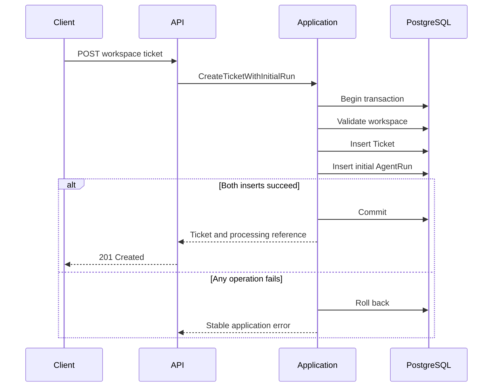

# Transactional AgentRun Scheduling

## Purpose

SupportOps AI Platform creates a durable processing record whenever a support
ticket is accepted.

The ticket and its initial `AgentRun` are persisted in the same PostgreSQL
transaction. This guarantees that a committed ticket always has a durable
processing reference and prevents work from being scheduled independently of
the business record it belongs to.

This document describes the scheduling boundary implemented before worker
execution is introduced.

## Scheduling flow



## Transaction boundary

`CreateTicketWithInitialRun` owns the transaction that coordinates:

1. workspace validation;
2. ticket persistence;
3. initial `AgentRun` persistence.

Repositories add and flush records through the shared SQLAlchemy session, but
do not commit independently.

This boundary ensures that:

- a successful ticket creation persists one initial `AgentRun`;
- an `AgentRun` insertion failure rolls back the ticket;
- a ticket conflict creates no additional `AgentRun`;
- the API does not schedule durable work in a second transaction.

No in-memory queue, external broker, or transactional outbox is involved in
this scheduling path. PostgreSQL stores the authoritative work record directly.

## Initial workflow contract

Each newly created ticket receives one initial run with the following contract:

```text
workflow_name = ticket-processing
workflow_version = deterministic-baseline-v1
trigger_key = initial-ticket-processing
status = queued
attempt_count = 0
```

The workflow version identifies the deterministic processing contract planned
for the first worker implementation.

A queued run does not indicate that AI classification has occurred. It records
only that durable processing has been scheduled.

## Retry budget persistence

The API copies the validated worker maximum-attempt setting into each newly
created `AgentRun`.

```text
SUPPORTOPS_WORKER_MAX_ATTEMPTS
```

The persisted value is immutable for that run. Future configuration changes do
not alter the retry budget of work that has already been scheduled.

## Workspace ownership invariant

PostgreSQL enforces ticket ownership through a composite foreign key:

```text
agent_runs(workspace_id, ticket_id)
    → tickets(workspace_id, id)
```

This prevents an `AgentRun` from declaring one workspace while referencing a
ticket owned by another workspace.

The supporting ticket constraint is:

```text
UNIQUE (workspace_id, id)
```

Workspace ownership is therefore protected by both the application boundary
and the database schema.

## Initial scheduling uniqueness

PostgreSQL prevents duplicate initial scheduling with:

```text
UNIQUE (ticket_id, trigger_key)
```

The initial trigger key is:

```text
initial-ticket-processing
```

Future explicit reprocessing can use a different trigger key without weakening
the invariant that a ticket has at most one initial processing run.

## Trace propagation

The initial run copies the identifiers persisted on the ticket:

```text
ingestion_request_id
correlation_id
```

Their meanings are:

```text
ingestion_request_id
= the HTTP request that accepted the ticket

correlation_id
= the cross-process identifier that will connect API and worker activity
```

The future worker will generate a separate execution request identifier for
each claimed attempt while preserving the run correlation identifier.

## Ticket creation response

The ticket creation endpoint returns:

```json
{
  "ticket": {
    "id": "6e688ded-cf71-4c01-b87f-591cc014af03",
    "workspace_id": "59ecc675-bf00-4f3b-8284-876f226539d6",
    "subject": "Unable to access billing",
    "description": "The dashboard returns an access error.",
    "status": "open",
    "external_reference": "SUP-1042",
    "ingestion_request_id": "dfe63a63-031c-4ea9-89dd-d556bd51766a",
    "correlation_id": "db320c15-e7de-4b36-8b22-11b96b3c68de",
    "created_at": "2026-07-31T12:00:00Z",
    "updated_at": "2026-07-31T12:00:00Z"
  },
  "processing_run": {
    "id": "24f24172-f39c-4dcf-9722-b073e22944d0",
    "status": "queued",
    "workflow_name": "ticket-processing",
    "workflow_version": "deterministic-baseline-v1"
  }
}
```

The endpoint returns `201 Created` because the ticket itself has been created
successfully. Processing remains asynchronous.

The minimal processing reference intentionally excludes:

- lease ownership;
- lease tokens;
- retry counters;
- error summaries;
- attempt history;
- internal persistence state.

Detailed run inspection is introduced through a separate workspace-scoped API
boundary.

## Persistence model

### AgentRun

`AgentRun` stores the durable lifecycle and scheduling state for one ticket
processing workflow.

Current persistence fields include:

- workspace and ticket ownership;
- workflow identity and version;
- trigger identity;
- lifecycle status;
- availability timestamp;
- retry budget;
- lease fields reserved for worker ownership;
- terminal timestamps;
- safe error fields;
- request and correlation identifiers.

### AgentRunAttempt

`AgentRunAttempt` stores the history of each future claimed execution.

The table exists in the persistence model, but scheduling does not create an
attempt. Attempts are created only when a worker successfully claims a run.

## Current boundary

The current implementation provides:

- durable initial work creation;
- transactional ticket and run persistence;
- database-enforced workspace ownership;
- duplicate initial scheduling protection;
- stable initial workflow identity;
- minimal processing references in the ticket creation response;
- integration coverage for commit and rollback behavior.

It does not yet execute queued runs.

The PostgreSQL worker, atomic claim operation, leases, fencing, retries, stale
ownership recovery, and attempt lifecycle are introduced as the next
independently reviewable capability.