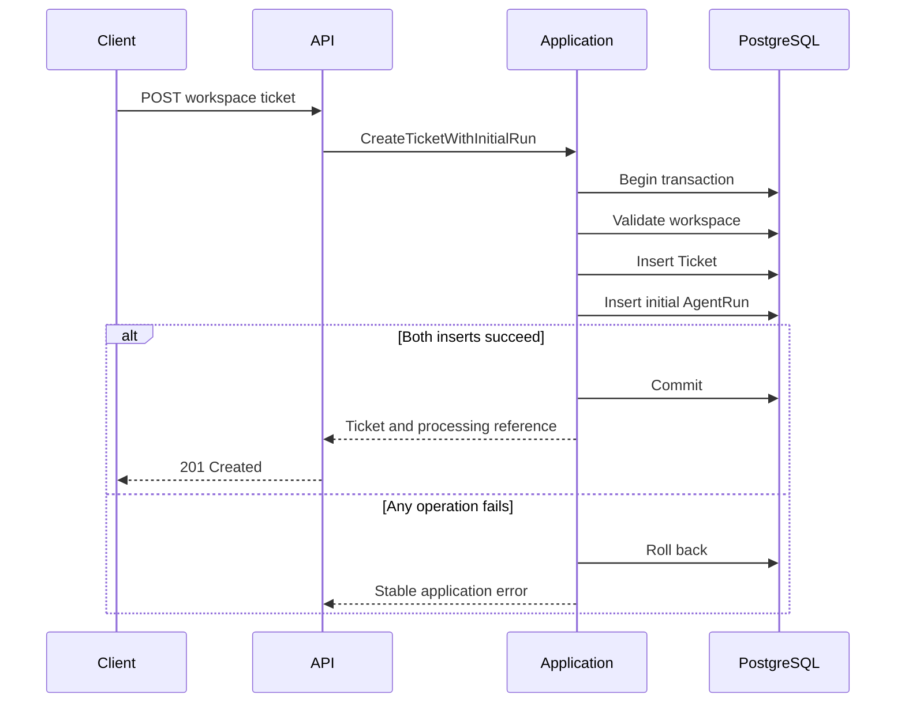

# Transactional AgentRun Scheduling

## Purpose

SupportOps AI Platform creates a durable processing record whenever a support
ticket is accepted.

The ticket and its initial `AgentRun` are persisted in the same PostgreSQL
transaction. This guarantees that a committed ticket always has a durable
processing reference and prevents work from being scheduled independently of
the business record it belongs to.

This document focuses on transactional scheduling and the handoff boundary to
worker processing. Runtime process topology and worker operations are detailed
in [`runtime-topology.md`](runtime-topology.md).

## Scheduling flow



## Transaction boundary

`CreateTicketWithInitialRun` owns the transaction that coordinates:

1. workspace validation;
2. ticket persistence;
3. initial `AgentRun` persistence.

Repositories add and flush records through the shared SQLAlchemy session, but
do not commit independently.

This boundary ensures that:

- a successful ticket creation persists one initial `AgentRun`;
- an `AgentRun` insertion failure rolls back the ticket;
- a ticket conflict creates no additional `AgentRun`;
- the API does not schedule durable work in a second transaction;
- the HTTP request returns after the scheduling transaction commits;
- the HTTP request does not execute the workflow.

No in-memory queue, external broker, or transactional outbox is involved in
this scheduling path. PostgreSQL stores the authoritative work record directly.

Ticket acceptance and asynchronous processing success are separate outcomes.

## Initial workflow contract

Each newly created ticket receives one initial run with the following contract:

```text
workflow_name = ticket-processing
workflow_version = deterministic-baseline-v1
trigger_key = initial-ticket-processing
status = queued
attempt_count = 0
```

The workflow version identifies the deterministic baseline executor used by the
worker. That executor validates the workflow contract and performs no external
I/O, LLM call, retrieval, or ticket classification. It exists to validate the
durable execution architecture independently from future AI behavior.

A queued run does not indicate that AI classification has occurred. It records
only that durable processing has been scheduled.

## Queued state and availability

After a successful scheduling commit, the initial `AgentRun` is available for
worker claim when:

- status is `queued`;
- `available_at` is due;
- `attempt_count` is below `max_attempts`.

The initial run sets `available_at` to the scheduling timestamp, so it becomes
eligible immediately after commit.

Later retries use status `retry_scheduled` with a future `available_at`. Those
runs become claim-eligible only after their availability time is due.

## After initial scheduling

Once the API transaction commits:

1. the ticket exists with status `open`;
2. the initial `AgentRun` exists with status `queued`;
3. no `AgentRunAttempt` has been created yet;
4. the HTTP response returns a minimal `processing_run` projection;
5. the separate worker process becomes responsible for recovery, claim,
   execution, and fenced outcome persistence.

The API does not claim runs, acquire leases, execute the workflow, or report
final processing success in the ticket creation response.

## Worker claim eligibility

The worker claims at most one eligible run per cycle.

Eligible states are:

```text
queued
retry_scheduled
```

Claim eligibility also requires:

- `available_at` due at claim time;
- `attempt_count` below `max_attempts`.

Deterministic claim ordering is:

```text
available_at ASC, created_at ASC, id ASC
```

PostgreSQL `FOR UPDATE SKIP LOCKED` allows multiple worker processes to claim
distinct runs safely.

## Attempt creation

A successful claim:

- changes the run to `running`;
- increments `attempt_count`;
- creates one `AgentRunAttempt`;
- assigns a lease owner, lease token, and lease expiry;
- commits before executor work begins.

The claim transaction does not execute the workflow. Execution happens after
that commit.

## Execution outside transaction

After claim commit, the worker:

1. loads the ticket in a short transaction;
2. runs the configured executor outside database transactions;
3. bounds execution with a timeout;
4. persists success or failure in a separate fenced transaction.

The current executor is `deterministic-ticket-processing`. Typed retryable and
terminal failures are handled explicitly. Unexpected exceptions become
sanitized retryable failures. Raw exception text is not persisted.

## Success, failure, and retry transitions

Persisted `AgentRun` states are:

```text
queued
running
retry_scheduled
succeeded
failed
```

Persisted attempt outcomes include:

```text
succeeded
retryable_failure
terminal_failure
timed_out
lease_expired
```

Successful completion changes the run to `succeeded`, closes the active
attempt, and clears previous safe error details.

Retryable failures and timeouts are retried only while attempt budget remains.
Retry scheduling uses bounded exponential backoff and moves the run to
`retry_scheduled` with a future `available_at`.

Terminal failures and exhausted retryable failures change the run to `failed`.

## Lease-token fencing

Outcome persistence uses lease-token fencing.

Only the active lease token may complete or fail the current running attempt.
A repeated or stale completion returns `lease_lost` and does not modify the
current state.

Delivery semantics are at-least-once execution. Exactly-once execution is not
claimed. Future executors and tools must make side effects idempotent or
otherwise safely fenced.

## Recovery relationship

Every worker cycle attempts expired lease recovery before claiming available
work.

Recovery selects expired `running` runs, closes the abandoned attempt with
outcome `lease_expired`, and does not increment `attempt_count` or create a
new attempt. A recoverable run returns to `retry_scheduled`. An exhausted run
becomes `failed`.

Recovery and claim remain separate operations. Scheduling itself does not
perform recovery.

## Retry budget persistence

The API copies the validated worker maximum-attempt setting into each newly
created `AgentRun`.

```text
SUPPORTOPS_WORKER_MAX_ATTEMPTS
```

The persisted value is immutable for that run. Future configuration changes do
not alter the retry budget of work that has already been scheduled.

## Workspace ownership invariant

PostgreSQL enforces ticket ownership through a composite foreign key:

```text
agent_runs(workspace_id, ticket_id)
    → tickets(workspace_id, id)
```

This prevents an `AgentRun` from declaring one workspace while referencing a
ticket owned by another workspace.

The supporting ticket constraint is:

```text
UNIQUE (workspace_id, id)
```

Workspace ownership is therefore protected by both the application boundary
and the database schema.

## Initial scheduling uniqueness

PostgreSQL prevents duplicate initial scheduling with:

```text
UNIQUE (ticket_id, trigger_key)
```

The initial trigger key is:

```text
initial-ticket-processing
```

Future explicit reprocessing can use a different trigger key without weakening
the invariant that a ticket has at most one initial processing run.

## Trace propagation

The initial run copies the identifiers persisted on the ticket:

```text
ingestion_request_id
correlation_id
```

Their meanings are:

```text
ingestion_request_id
= the HTTP request that accepted the ticket

correlation_id
= the cross-process identifier that connects API and worker activity
```

The worker generates a separate execution request identifier for each claimed
attempt while preserving the run correlation identifier.

## Ticket creation response

The ticket creation endpoint returns:

```json
{
  "ticket": {
    "id": "6e688ded-cf71-4c01-b87f-591cc014af03",
    "workspace_id": "59ecc675-bf00-4f3b-8284-876f226539d6",
    "subject": "Unable to access billing",
    "description": "The dashboard returns an access error.",
    "status": "open",
    "external_reference": "SUP-1042",
    "ingestion_request_id": "dfe63a63-031c-4ea9-89dd-d556bd51766a",
    "correlation_id": "db320c15-e7de-4b36-8b22-11b96b3c68de",
    "created_at": "2026-07-31T12:00:00Z",
    "updated_at": "2026-07-31T12:00:00Z"
  },
  "processing_run": {
    "id": "24f24172-f39c-4dcf-9722-b073e22944d0",
    "status": "queued",
    "workflow_name": "ticket-processing",
    "workflow_version": "deterministic-baseline-v1"
  }
}
```

The endpoint returns `201 Created` because the ticket itself has been created
successfully. Processing remains asynchronous. The response does not report
final processing success.

The minimal processing reference intentionally excludes:

- lease ownership;
- lease tokens;
- retry counters;
- error summaries;
- attempt history;
- internal persistence state.

Detailed run inspection is introduced through a separate workspace-scoped API
boundary.

## Persistence model

### AgentRun

`AgentRun` stores the durable lifecycle and scheduling state for one ticket
processing workflow.

Current persistence fields include:

- workspace and ticket ownership;
- workflow identity and version;
- trigger identity;
- lifecycle status;
- availability timestamp;
- retry budget;
- lease ownership fields used by the worker;
- terminal timestamps;
- safe error fields;
- request and correlation identifiers.

### AgentRunAttempt

`AgentRunAttempt` stores the history of each claimed execution.

Scheduling does not create an attempt. Attempts are created only when a worker
successfully claims a run.

## Current boundary

The current implementation provides:

- durable initial work creation;
- transactional ticket and run persistence;
- database-enforced workspace ownership;
- duplicate initial scheduling protection;
- stable initial workflow identity;
- minimal processing references in the ticket creation response;
- handoff to PostgreSQL worker claim, execution, fencing, retry, and recovery;
- integration coverage for commit and rollback behavior.

AgentRun inspection endpoints remain planned. Redis, Celery, Kafka, SQS, and an
outbox remain intentionally deferred because PostgreSQL already provides
transactional durability and adequate local and portfolio scope for this phase.
