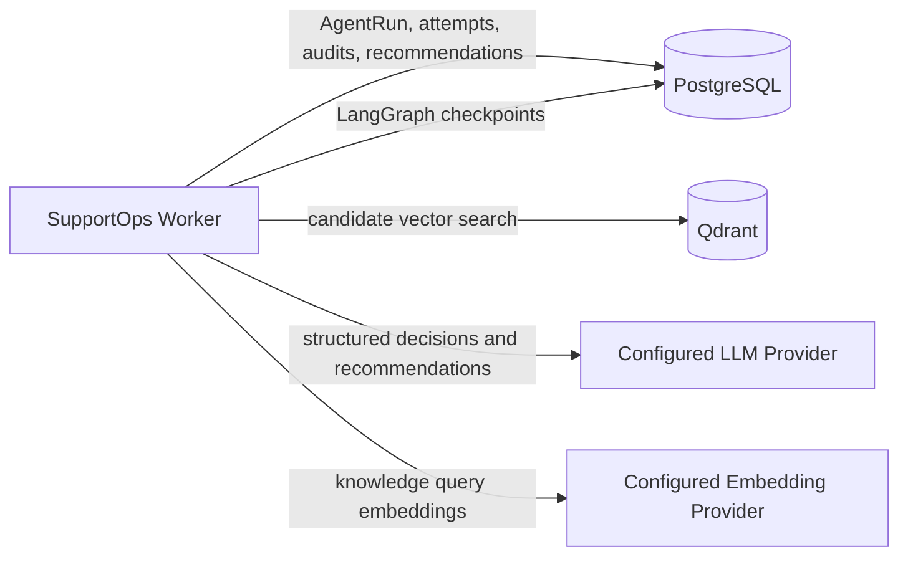
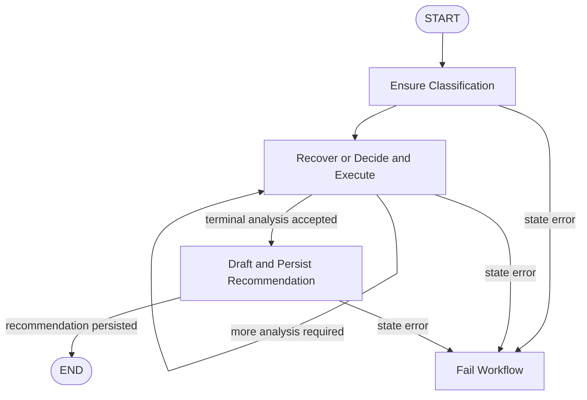

# Controlled Support Workflow

## Purpose

This document describes the controlled support workflow implemented by SupportOps AI Platform.

The workflow extends durable ticket processing from structured classification into bounded, evidence-driven support analysis. It combines:

- durable `AgentRun` scheduling and lease-fenced execution;
- LangGraph orchestration with PostgreSQL checkpoints;
- application-owned LLM contracts and prompt provenance;
- controlled read-only tool execution;
- semantic knowledge retrieval over active document versions;
- durable tool-call, invocation, recommendation, and citation records;
- workspace-scoped inspection through a read-only HTTP API.

The workflow is designed for reliable operational analysis rather than unrestricted agent autonomy.

## Business responsibility

The controlled workflow analyzes one accepted support ticket and produces one persisted support recommendation.

It may:

- classify the ticket;
- inspect active internal knowledge;
- inspect deterministic service status;
- decide whether additional evidence is required;
- stop through an explicit terminal control;
- persist a recommendation and supporting citations.

It does not:

- modify the ticket;
- send a customer response;
- mutate external systems;
- approve sensitive actions;
- execute write-capable tools;
- make authorization decisions.

Human approval and write-capable operations remain separate workflow boundaries.

## Workflow identity

The implemented workflow is registered under:

```text
workflow_name = ticket-processing
workflow_version = controlled-support-v1
trigger_key = initial-ticket-processing
```

Newly accepted tickets use `controlled-support-v1` as the default configured workflow version.

The worker registry retains:

```text
ticket-processing / deterministic-baseline-v1
ticket-processing / ticket-classification-v1
ticket-processing / controlled-support-v1
```

Exact workflow name and version dispatch is required. Unknown names or versions fail closed.

## Architectural boundaries

The implementation separates outer execution durability from inner graph orchestration.

```text
AgentRun
└── outer execution boundary
    ├── scheduling
    ├── claiming
    ├── attempt history
    ├── lease ownership
    ├── timeout
    ├── retries
    └── final success or failure

LangGraph
└── inner orchestration boundary
    ├── bounded state transitions
    ├── node routing
    ├── tool loop
    ├── recommendation step
    └── checkpoint resume
```

`ProcessClaimedAgentRun` remains responsible for the lifecycle of the outer `AgentRun`.

LangGraph never marks the `AgentRun` as succeeded or failed. The graph executor returns successfully only after a recommendation identity exists in validated graph state. The outer processor then performs the lease-fenced completion transition.

This separation preserves the existing PostgreSQL worker model while allowing internal workflow progress to resume from checkpoints.

## Runtime topology

The controlled workflow runs inside the separate `supportops-worker` process.

The worker owns these process-scoped resources:

- one SQLAlchemy engine and session factory;
- one configured LLM provider;
- one application-owned LLM Gateway;
- one PostgreSQL checkpoint runtime;
- one embedding provider;
- one Qdrant client;
- one immutable knowledge index profile;
- one Qdrant knowledge vector store and search adapter.

Each worker cycle creates session-scoped repositories, transaction adapters, workflow services, and the executor registry from one `AsyncSession`.

Process-scoped provider and infrastructure clients are reused across cycles. SQLAlchemy sessions and repositories are not shared across cycles.



The API process continues to own request-driven semantic retrieval for the public knowledge-search endpoint. The worker independently owns the resources required for controlled workflow retrieval.

## Graph state and runtime context

The graph state is durable, bounded, JSON-compatible, and versioned.

It contains only information required to resume deterministic orchestration, including:

- workspace, ticket, and `AgentRun` identity;
- graph schema and workflow versions;
- accepted classification projection;
- graph-step count;
- decision-turn count;
- tool-call count;
- seen tool-call fingerprints;
- persisted tool-call identities;
- retrieval query and chunk identities;
- service-status audit identities;
- terminal analysis projection;
- accepted recommendation invocation identity;
- persisted recommendation identity;
- stable current error code.

The graph state intentionally excludes:

- `AgentRunAttempt` identity;
- lease owner;
- lease token;
- lease expiry;
- provider credentials;
- raw provider responses;
- raw prompt content;
- retrieved document content;
- SQLAlchemy entities;
- process-local clients.

Attempt and lease-fencing data are carried through runtime context. This prevents durable checkpoints from becoming a second ownership source and avoids persisting transient security-sensitive execution credentials.

## Checkpoint identity

Checkpoint identity is deterministic for one `AgentRun`.

```text
thread_id = AgentRun UUID
checkpoint namespace = controlled workflow version namespace
```

A resumed checkpoint must match the requested:

- workspace;
- ticket;
- `AgentRun`;
- workflow;
- graph version;
- state schema version.

Ownership or compatibility mismatches fail closed.

The worker compiles the graph with the process-scoped PostgreSQL checkpointer and uses synchronous checkpoint durability at node boundaries.

## Graph lifecycle

The controlled graph follows this lifecycle:



The effective graph operations are:

1. load or create the persisted ticket classification;
2. recover a committed tool outcome that may not yet exist in graph state;
3. request the next provider-independent decision;
4. execute a validated read-only tool when requested;
5. return to the decision boundary;
6. accept `complete_support_analysis` as the only terminal control;
7. draft or recover the final recommendation;
8. persist the recommendation and citations;
9. terminate only when the persisted recommendation identity is attached.

## Bounded execution

The application enforces independent limits:

```text
maximum graph steps = 16
LangGraph recursion limit = 20
maximum decision turns = 4
maximum controlled tool calls = 3
tool execution timeout = 15 seconds
worker execution timeout = 135 seconds
worker lease duration = 150 seconds
lease safety margin = 15 seconds
```

The recursion limit is intentionally greater than the application graph-step limit. The application-owned graph state remains the business limit, while the LangGraph recursion limit provides a framework-level final guard.

The worker settings validator reserves enough time for:

- one classification generation;
- up to four decision generations;
- one recommendation generation;
- configured structured-output repair attempts;
- the execution safety margin.

A provider invocation budget that cannot fit inside the worker execution timeout is rejected during settings validation.

## Classification reuse

The controlled workflow reuses the durable ticket-classification boundary.

The classification executor supports:

```text
ticket-classification-v1
controlled-support-v1
```

For the controlled workflow:

1. the graph queries for an existing accepted classification;
2. when absent, the classification executor invokes the Gateway outside a database transaction;
3. invocation and classification persistence remain lease-fenced;
4. the graph reloads the durable classification;
5. the validated classification projection is attached to checkpoint state.

A crash after classification persistence does not require another classification provider call.

## Decision contract

Model-selected workflow behavior crosses an application-owned, provider-independent contract.

A decision may be:

- an executable call to a registered controlled tool; or
- the terminal `complete_support_analysis` control.

The model cannot select arbitrary Python functions, infrastructure adapters, or unregistered tools.

Decision invocations persist:

- workspace, ticket, `AgentRun`, and attempt ownership;
- invocation sequence;
- provider and model;
- prompt ID, version, and content hash;
- schema version;
- token usage;
- historical estimated cost;
- latency;
- stable error metadata.

Raw provider requests, raw responses, rendered prompts, and provider credentials are not persisted as inspection data.

## Terminal control

The only terminal model control is:

```text
complete_support_analysis
```

This control is not an executable tool.

Its validated output records:

- recommended action;
- whether evidence is sufficient;
- whether human review is required;
- a bounded decision summary.

Supported recommendation actions are:

```text
respond
request_more_information
recommend_escalation
```

The terminal control ends the decision loop but does not complete the outer `AgentRun`. Completion still requires durable recommendation persistence.

## Controlled tool registry

The workflow exposes exactly two read-only tools:

```text
search_knowledge / v1
lookup_service_status / v1
```

The registry rejects:

- unknown tools;
- unsupported versions;
- write-capable safety levels;
- malformed structured arguments;
- duplicate or conflicting provider call identities.

Tool selection does not grant the model authority over execution policy. The application validates every call before execution.

## Knowledge search tool

`search_knowledge` uses the existing semantic retrieval architecture.

The controlled tool:

1. validates workspace-owned search arguments;
2. resolves eligible active ready knowledge versions from PostgreSQL;
3. avoids embedding and Qdrant work for an empty eligible scope;
4. creates one query embedding;
5. queries Qdrant for bounded candidates;
6. hydrates authoritative chunks from PostgreSQL;
7. validates workspace, document, version, chunk, profile, and content provenance;
8. returns bounded evidence identities and prompt-safe content;
9. persists the retrieval query and selected chunk provenance in the tool audit.

Qdrant remains a rebuildable candidate index. PostgreSQL remains authoritative for chunk content and provenance.

## Service-status tool

`lookup_service_status` uses a deterministic application-owned service catalog.

It returns a bounded status projection such as:

```text
service name
operational status
optional incident reference
```

The tool performs no external mutation and does not grant the model direct access to monitoring infrastructure.

## Tool-call durability

Every controlled tool call produces a terminal `AgentToolCall` audit record.

The record includes:

- workspace, ticket, `AgentRun`, and attempt ownership;
- attempt-local sequence;
- provider tool-call identity;
- tool name and version;
- read-only safety level;
- canonical input fingerprint;
- bounded safe input;
- bounded safe output;
- terminal status;
- latency;
- stable error code;
- start and finish timestamps.

Persistence is lease-fenced. A stale worker cannot record a tool result after ownership has moved to another attempt.

Tool calls execute outside database transactions. Only validation, exact recovery queries, and fenced terminal persistence use short transactions.

## Crash recovery around tool execution

A process may fail after a terminal tool audit commits but before the graph checkpoint records that result.

To prevent duplicate execution, the decision node performs recovery before requesting another model decision.

```text
enter decision node
→ query exact next persisted tool audit
→ if present, project it into graph state
→ skip provider decision and tool execution
→ continue workflow
```

If no recoverable audit exists:

```text
request decision
→ validate tool call
→ execute tool outside transaction
→ persist terminal audit under lease fencing
→ project audit into graph state
```

This design closes the post-commit/pre-checkpoint crash window without placing pending provider tool arguments in graph state.

## Reconstructing tool observations

Prompt observations are reconstructed from durable records rather than process memory.

For service-status tools, the assembler validates and projects the bounded persisted output.

For knowledge search, the assembler:

- validates the persisted audit identity and fingerprint;
- loads authoritative referenced chunks from PostgreSQL;
- verifies workspace and provenance ownership;
- verifies content hashes and retrieval metadata;
- reconstructs prompt-safe evidence;
- builds citation sources for recommendation persistence.

Qdrant is not used as a recovery source. It identifies candidates during execution; PostgreSQL reconstructs authoritative evidence during resume.

## Recommendation generation

Recommendation drafting uses a versioned application-owned prompt and structured response contract.

The recommendation provider call occurs outside database transactions.

The accepted result includes:

- recommended action;
- response text;
- human-review requirement;
- decision summary.

The application validates that recommendation semantics remain compatible with the accepted terminal analysis.

The recommendation invocation persists through the same logical invocation history used by classification and decision calls.

## Recommendation persistence

A successful workflow persists one `SupportRecommendation` per `AgentRun`.

The recommendation stores:

- workspace, ticket, `AgentRun`, and classification ownership;
- accepted recommendation invocation identity;
- recommended action;
- response text;
- human-review requirement;
- decision summary;
- prompt ID, version, and content hash;
- provider and model;
- creation timestamp.

Knowledge-backed recommendations may persist ordered `SupportRecommendationCitation` records containing:

- citation order;
- retrieval query identity;
- retrieval rank and score;
- document identity;
- document-version identity;
- chunk identity.

Recommendation and citations persist atomically under the active lease.

A retry first queries for an existing recommendation. Exact recovery attaches the existing identity without another provider call or duplicate recommendation write.

## Failure model

The workflow distinguishes retryable and terminal failures.

Examples of retryable failures include:

- provider timeout or temporary unavailability;
- embedding dependency unavailability;
- Qdrant dependency unavailability;
- PostgreSQL checkpoint unavailability;
- retryable tool timeout or dependency failure.

Examples of terminal failures include:

- unsupported workflow identity;
- incompatible checkpoint state;
- checkpoint ownership mismatch;
- invalid provider decision;
- unsupported tool or tool version;
- exhausted graph, decision, or tool limits;
- inconsistent persisted audit provenance;
- recommendation validation failure;
- completed graph without a persisted recommendation.

The graph returns typed execution errors. The outer processor applies retry policy, attempt budget, timeout handling, and final lease-fenced state transitions.

Raw exception text is not persisted in public operational fields.

## Delivery and idempotency semantics

The platform provides at-least-once `AgentRun` execution.

It does not claim exactly-once provider invocation or exactly-once process execution.

Safety comes from:

- durable `AgentRun` attempts;
- lease-token fencing;
- exact attempt-local invocation sequences;
- exact attempt-local tool-call sequences;
- accepted classification uniqueness;
- terminal tool-call audit recovery;
- recommendation uniqueness;
- checkpoint resume;
- idempotent recovery after durable commits.

Read-only tools reduce external side-effect risk. Future write-capable tools must introduce approval, idempotency, and external side-effect fencing appropriate to each operation.

## Checkpoint schema ownership

LangGraph PostgreSQL checkpoint tables are framework-owned:

```text
checkpoint_migrations
checkpoints
checkpoint_blobs
checkpoint_writes
```

`AsyncPostgresSaver.setup()` owns their creation and internal migrations.

These tables:

- are not mapped as application ORM entities;
- are not created by application Alembic migrations;
- are excluded by exact name from Alembic autogenerate comparison;
- are not deleted by business-table integration cleanup;
- are not exposed through the inspection API.

Application business records continue to use normal SQLAlchemy models and Alembic migrations.

## Inspection API

The read-only aggregate endpoint is:

```text
GET /api/v1/workspaces/{workspace_id}/tickets/{ticket_id}/agent-runs/{agent_run_id}/inspection
```

It supports `controlled-support-v1` only.

The response may include:

- safe `AgentRun` lifecycle summary;
- accepted classification;
- attempt-ordered tool-call summaries;
- attempt-ordered LLM invocation history;
- persisted token usage;
- persisted historical estimated cost;
- recommendation;
- ordered citation provenance.

Queued, running, retrying, and failed workflows may return valid partial inspection views.

A completed controlled workflow requires a persisted recommendation.

The inspection endpoint does not read LangGraph checkpoint blobs.

## Inspection security boundary

The inspection response intentionally excludes:

- lease owner, token, and expiry;
- execution request identifiers;
- checkpoint identity and checkpoint blobs;
- provider request identifiers;
- provider tool-call identifiers;
- raw prompts;
- rendered ticket prompts;
- raw provider requests and responses;
- raw tool arguments;
- complete safe-input and safe-output records;
- input fingerprints;
- source document bodies;
- retrieved chunk bodies;
- embeddings;
- credentials and connection details.

Reasoning token counts may be exposed as usage metadata. Reasoning content is never exposed.

## Workspace data ownership

Every durable controlled-workflow record carries or is validated through the root workspace, ticket, and `AgentRun` ownership chain.

Inspection root lookup requires:

```text
workspace_id
ticket_id
agent_run_id
```

Missing, cross-ticket, and cross-workspace lookups return the same not-found contract.

This prevents the API from disclosing that an `AgentRun` exists under another workspace.

Workspace scoping remains a data ownership boundary. Authentication and authorization remain intentionally separate future security capabilities.

## Cost provenance

LLM invocation records persist historical token usage and estimated cost at execution time.

Inspection aggregates persisted values only.

It does not recalculate historical usage using the current pricing catalog.

The API names the aggregate:

```text
estimated_cost_usd
```

This is an engineering estimate, not a provider invoice.

Unpriced invocations remain visible through a separate count.

## Operational characteristics

The workflow is intentionally bounded and suitable for a modular-monolith worker.

Expected characteristics include:

- one claimed `AgentRun` processed per worker cycle;
- short PostgreSQL transactions;
- provider, embedding, and Qdrant operations outside business transactions;
- process-scoped external clients;
- session-scoped repositories;
- bounded graph state;
- bounded tool and invocation history;
- deterministic ordering;
- resumable graph progress;
- no external message broker.

PostgreSQL remains both the durable business source of truth and the worker queue. An external broker is not required for the current workload and portfolio scope.

## Testing strategy

The workflow is covered through:

- domain invariant tests;
- graph routing and transition tests;
- provider decision normalization tests;
- bounded tool-execution tests;
- repository integration tests;
- fencing and stale-worker tests;
- post-commit/pre-checkpoint recovery tests;
- observation reconstruction tests;
- recommendation persistence tests;
- worker composition and lifecycle tests;
- PostgreSQL-backed LangGraph checkpoint resume tests;
- inspection repository tests;
- vertical HTTP inspection tests;
- cross-workspace isolation tests;
- migration parity checks.

The default automated suite uses deterministic mock providers and does not require paid provider calls.

## Scaling considerations

The current modular-monolith design can scale through multiple worker processes because claim and recovery use PostgreSQL row locks with `SKIP LOCKED`.

Additional scaling decisions may become necessary when:

- checkpoint volume requires separate retention policy;
- vector query throughput exceeds the current Qdrant deployment;
- provider concurrency requires explicit rate limiting;
- worker resource pools require workload partitioning;
- support actions become write-capable;
- workflow history requires long-term archival;
- inspection lists require pagination across many runs.

These concerns do not require splitting the workflow into microservices prematurely.

## Intentional scope decisions

The Slice 5 workflow intentionally defers:

- write-capable tools;
- customer-response delivery;
- human approval and resume APIs;
- workflow cancellation;
- workflow retry controls through HTTP;
- authentication and authorization;
- checkpoint inspection endpoints;
- raw graph-state exposure;
- RAGAS evaluation;
- recommendation-quality datasets;
- prompt-version comparison;
- Langfuse and Phoenix integration;
- operational dashboards;
- long-term checkpoint retention policy.

Human-in-the-loop approval and write-capable actions belong to the next workflow boundary.

Evaluation and observability capabilities will consume the durable provenance established here rather than changing workflow ownership.

## Related documentation

- [`overview.md`](overview.md)
- [`runtime-topology.md`](runtime-topology.md)
- [`agent-run-scheduling.md`](agent-run-scheduling.md)
- [`semantic-knowledge-retrieval.md`](semantic-knowledge-retrieval.md)
- [`../decisions/0010-separate-agent-run-and-langgraph-durability.md`](../decisions/0010-separate-agent-run-and-langgraph-durability.md)
- [`../decisions/0011-treat-langgraph-checkpoints-as-framework-owned-schema.md`](../decisions/0011-treat-langgraph-checkpoints-as-framework-owned-schema.md)