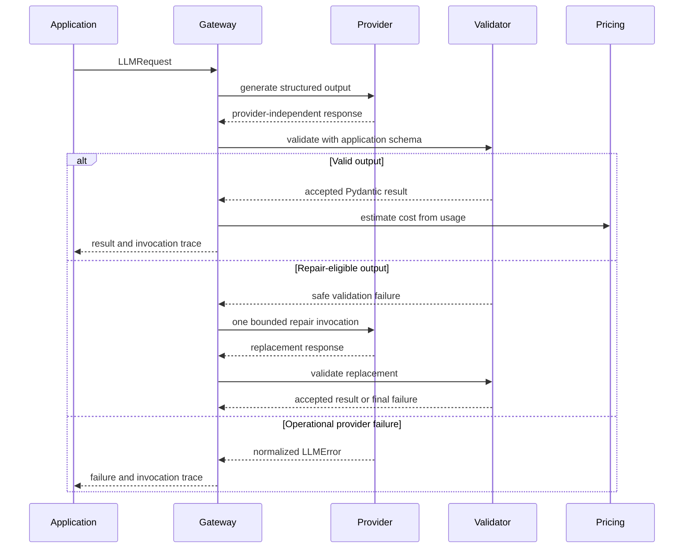
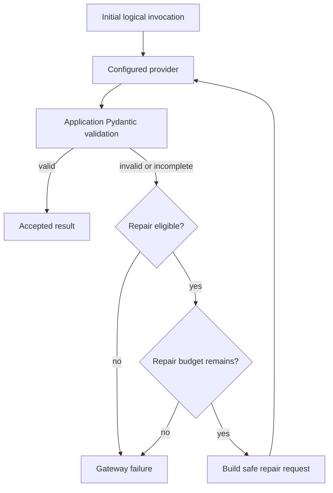

# Application-Owned LLM Gateway

## Purpose

SupportOps AI Platform isolates model-provider behavior behind an
application-owned LLM Gateway.

The gateway establishes the reliability boundary between deterministic
application behavior and probabilistic model execution. Business modules depend
on platform-defined contracts, schemas, errors, prompt provenance, and cost
estimates rather than importing provider SDK types directly.

This document describes the application-owned LLM Gateway and its use by the
durable ticket-classification workflow. Classification inspection APIs and
evaluation execution remain separate delivery boundaries.

Durable classification behavior is documented in
[`ticket-classification.md`](ticket-classification.md).

## Current implementation status

The current gateway and classification integration provide:

- a provider-independent asynchronous request and response contract;
- application-owned token usage metadata;
- a deterministic mock provider;
- an OpenAI Responses API provider;
- Structured Outputs through an application-owned Pydantic schema;
- application-side validation after provider parsing;
- normalized provider failures;
- bounded validation repair;
- immutable prompt definitions;
- explicit prompt ID and version lookup;
- deterministic prompt content hashes;
- a versioned pricing catalog;
- Decimal-based estimated-cost calculation;
- validated provider, model, timeout, retry, repair, and workflow settings;
- process-scoped provider and Gateway composition in the worker;
- session-scoped classification executor dispatch;
- durable `LLMInvocation` persistence;
- durable accepted `TicketClassification` persistence.

The current delivery does not yet:

- expose classification inspection APIs;
- execute real-model evaluation datasets;
- introduce prompt version 2;
- provide cross-provider fallback or automatic model routing.

## Architectural boundary

The application owns:

- operation identity;
- provider selection;
- model configuration;
- prompt identity and version;
- prompt rendering;
- output schema selection;
- application validation;
- repair eligibility and repair limits;
- retryability and terminal-failure semantics;
- invocation provenance;
- token and estimated-cost interpretation;
- persistence decisions;
- workflow completion.

A provider adapter owns:

- SDK client construction;
- provider-specific request construction;
- provider-specific response parsing;
- provider request identifier extraction;
- provider usage extraction;
- refusal detection;
- incomplete-response detection;
- SDK exception normalization;
- provider client shutdown.

Provider SDK objects do not cross this boundary.

## Package structure

```text
src/supportops/ai/
├── gateway/
│   ├── contracts.py
│   ├── errors.py
│   ├── results.py
│   └── service.py
├── pricing/
│   ├── catalog.py
│   └── estimation.py
├── prompts/
│   ├── definitions.py
│   ├── registry.py
│   └── ticket_classification_v1.py
├── providers/
│   ├── mock.py
│   └── openai.py
└── schemas/
    └── ticket_classification.py
```

This structure is intentionally narrow. It supports the ticket-classification
workflow without introducing a generic AI framework.

Durable classification execution and persistence live under
`supportops.modules.ticket_classifications`. That module consumes gateway
contracts and does not move provider, prompt, schema, or pricing
responsibilities into the classification package.

## Request flow



The pricing step is applied when invocation records are prepared for
persistence. Provider responses do not calculate application cost.

## Provider-independent contract

### Request

`LLMRequest` contains:

```text
operation
model
instructions
input
output_schema
timeout_seconds
metadata
```

The request carries only application-owned values.

`instructions` and `input` are separate fields. Trusted task instructions are
not concatenated with untrusted ticket data.

`output_schema` is a Pydantic model type owned by the application.

`metadata` is copied into an immutable mapping before the request is used.

### Response

`LLMProviderResponse` contains:

```text
parsed_output
provider
model
provider_request_id
usage
finish_reason
```

The response does not contain:

- OpenAI response objects;
- provider exception objects;
- raw HTTP clients;
- raw response payloads;
- authorization headers;
- API keys.

The gateway verifies that response provider and model provenance match the
configured request. A mismatch is treated as an internal contract violation
rather than an external provider outage.

### Token usage

`LLMTokenUsage` preserves:

```text
input_tokens
cached_input_tokens
output_tokens
reasoning_tokens
total_tokens
```

Unknown provider-reported values remain `null`.

Missing values are not converted to zero.

Cached input tokens must not exceed input tokens. Reasoning tokens must not
exceed output tokens. When input, output, and total tokens are all known, total
tokens must equal input plus output.

## Structured ticket classification

The initial application-owned schema is:

```text
ticket-classification-v1
```

It accepts only these fields:

```text
category
intent
urgency
sentiment
requires_human_review
summary
schema_version
```

Extra fields are forbidden.

The schema uses bounded enums and does not silently convert unknown values to
`other`.

`requires_human_review` is a strict boolean.

`summary` is normalized by trimming surrounding whitespace and must contain
between 1 and 500 characters.

The validated result is immutable.

The schema intentionally excludes:

- model-generated confidence;
- chain-of-thought;
- hidden reasoning;
- arbitrary suggested actions;
- escalation targets;
- ticket mutations.

Structured Outputs constrain provider generation but do not replace
application-side validation. The application validates every accepted result
through its own Pydantic model.

## Prompt identity and versioning

The initial prompt is:

```text
prompt_id = ticket-classification
version = 1
output_schema_id = ticket-classification-v1
```

Prompt definitions are immutable repository artifacts.

Each definition contains:

```text
prompt_id
version
description
instructions
input_template
output_schema_id
content_hash
```

The prompt registry:

- rejects duplicate prompt ID and version pairs;
- requires explicit version lookup;
- has no mutable `latest` alias;
- remains independent from provider selection;
- remains independent from model selection;
- returns immutable definitions.

The content hash is SHA-256 over canonical UTF-8 JSON containing the complete
prompt definition.

Ticket content does not participate in the prompt definition hash. Different
tickets therefore preserve the same prompt provenance when the same prompt
version is selected.

### Untrusted ticket data

The prompt separates trusted instructions from rendered ticket data.

Ticket subject and description are encoded as deterministic JSON and placed
inside an explicit untrusted-data boundary.

The instructions state that ticket content:

- may contain instructions;
- may attempt to override the task;
- must be treated only as support-ticket data;
- cannot alter the taxonomy or schema;
- cannot select providers or models;
- cannot request tools;
- cannot change workflow behavior;
- cannot request hidden reasoning.

Prompt version 2 is intentionally absent. A new version requires evaluation
evidence that justifies a behavioral change.

## Provider implementations

### Mock provider

`MockLLMProvider` is a deterministic, network-free provider.

Its provenance is explicit:

```text
provider = mock
model = mock-ticket-classifier-v1
```

The default result is deterministic and independent of ticket keywords.

Tests may supply explicitly ordered outcomes for:

- successful structured output;
- refusal;
- timeout;
- retryable provider failure;
- terminal provider failure;
- incomplete response;
- intentionally invalid structured output.

The mock provider does not:

- inspect ticket content to trigger hidden behavior;
- pretend to be OpenAI;
- use randomness;
- perform network requests;
- activate after another provider fails;
- serve as a production fallback.

A strict outcome queue fails when its configured outcomes are exhausted. This
prevents tests from hiding missing failure configuration.

### OpenAI provider

`OpenAILLMProvider` uses:

```text
AsyncOpenAI
Responses API
responses.parse
Pydantic Structured Outputs
```

The provider constructs one Responses API request with:

```text
model
instructions
input
text_format
metadata
store = false
timeout
```

The adapter captures the provider request identifier when available and maps
provider usage into `LLMTokenUsage`.

The configured model must match the model carried by the application request.
The adapter does not route or switch models.

The initial configurable default model is:

```text
gpt-5-nano
```

The model identifier remains deployment-owned and is not distributed across
business modules.

Moving aliases may receive provider updates. Every durable invocation persists
the exact configured identifier. A stable snapshot can be selected through
configuration when reproducibility requirements justify it.

### Provider lifecycle

The OpenAI adapter supports explicit asynchronous shutdown.

The process lifecycle is:

```text
worker startup
→ create one configured provider client
→ create one LLM Gateway
→ reuse provider and Gateway across executions
→ close the provider during worker shutdown
```

The adapter does not create a new HTTP client for each ticket.

The API process does not initialize OpenAI merely because the worker can use it.

The mock provider owns no external network resource but implements the same
asynchronous lifecycle contract.

## Provider error normalization

Provider failures are converted to stable application-owned errors.

| Application error | Meaning | Retryable | Terminal | Repairable |
| --- | --- | ---: | ---: | ---: |
| `LLMTimeoutError` | Request exceeded its configured timeout | yes | no | no |
| `LLMRateLimitError` | Temporary provider rate limit | yes | no | no |
| `LLMAuthenticationError` | Credentials were rejected | no | yes | no |
| `LLMQuotaError` | Account quota or spend capacity was exhausted | no | yes | no |
| `LLMInvalidRequestError` | Request, schema, permission, or model was invalid | no | yes | no |
| `LLMProviderUnavailableError` | Provider connection or service was unavailable | yes | no | no |
| `LLMRefusalError` | Provider explicitly refused the request | no | yes | no |
| `LLMIncompleteResponseError` | Structured response was incomplete | yes | no | yes |
| `LLMOutputValidationError` | Output failed application validation | no | yes | yes |
| `LLMUnexpectedProviderError` | Failure could not be classified more precisely | yes | no | no |

Error strings contain only stable safe summaries.

Raw SDK messages are not application contracts and are not carried into public
responses or durable persistence records.

Provider request identifiers may be retained internally for operational
traceability but are not part of the safe error summary.

Programming defects and internal invariant violations are not converted into
provider-unavailable errors. Preserving that distinction prevents application
bugs from being hidden as transient provider failures.

## Retry layers

The platform separates three retry concepts.

### Provider transport retry

Transport retry belongs to the provider SDK.

For OpenAI, the configured SDK value is:

```text
SUPPORTOPS_LLM_TRANSPORT_MAX_RETRIES
```

The application does not wrap the SDK in another manual transport retry loop.

Transport retries address eligible connection, server, and temporary
rate-limiting failures inside one logical provider invocation.

### Gateway repair

Repair belongs to the application-owned gateway.

The configured maximum is:

```text
SUPPORTOPS_LLM_MAX_REPAIR_ATTEMPTS
```

The accepted range is zero or one.

A repair is a new logical provider invocation. It may occur after:

- application output validation failure;
- incomplete structured output;
- provider-side structured validation failure normalized as repairable.

Repair does not occur after:

- refusal;
- timeout;
- authentication failure;
- quota exhaustion;
- invalid request;
- temporary provider unavailability;
- temporary rate limiting.

The repair request preserves:

- operation;
- provider;
- model;
- prompt identity;
- prompt version;
- output schema;
- timeout;
- original untrusted input.

It adds only safe validation feedback. Raw invalid values and stack traces are
not inserted into the repair request.

### AgentRun retry

AgentRun retry is the outer operational layer.

It is responsible for:

- retry scheduling;
- retry backoff;
- attempt exhaustion;
- terminal workflow state;
- durable attempt history.

The gateway does not schedule AgentRun retries.

The classification executor translates final gateway failures into the existing
retryable or terminal AgentRun execution contract.

### Retry multiplication

One AgentRun attempt can contain:

```text
one initial logical invocation
+ at most one repair logical invocation
```

Each logical invocation may use the explicitly configured SDK transport retry
budget.

These layers are measured and documented separately. Repair attempts are not
transport attempts, and AgentRun attempts are not provider invocations.

## Repair flow



The repair request requires a complete replacement response. Partial output is
never persisted as an accepted classification.

## Invocation traces

The gateway returns safe metadata for each logical invocation:

```text
invocation_sequence
status
provider
model
provider_request_id
usage
latency_ms
error_code
```

Supported trace statuses are:

```text
succeeded
refused
incomplete
validation_failed
provider_failed
timed_out
```

The accepted result identifies the successful logical invocation sequence.

Gateway failures preserve both:

- the final normalized `LLMError`;
- every logical invocation trace produced before failure.

This allows the classification workflow to persist initial and repair attempts
without reconstructing provider behavior.

The Gateway returns in-memory traces. `TicketClassificationExecutor`
materializes each trace as a durable `LLMInvocation`. Invocation sequence is
scoped to an `AgentRunAttempt`. The accepted classification references the exact
successful invocation UUID.

## Token usage and estimated cost

The provider reports usage. The application estimates cost.

The pricing catalog is:

- immutable at runtime;
- versioned;
- provider-specific;
- model-specific;
- independent from provider response objects;
- calculated with `Decimal`.

The initial catalog contains explicit entries for:

```text
mock / mock-ticket-classifier-v1
openai / gpt-5-nano
```

The mock model has an explicit known cost of zero.

A missing pricing entry is different from a zero-price entry.

For unknown pricing:

```text
pricing_found = false
estimated costs = null
```

Token usage remains available.

Cached input cost is calculated separately:

```text
uncached input tokens = input tokens - cached input tokens
```

Reasoning tokens are included within output tokens and are not charged a second
time.

Estimated values use deterministic decimal rounding. Provider invoices remain
the authoritative billing source.

The pricing catalog version used for each estimate is persisted with the
durable invocation record. Mock cost is an explicit known zero. Unknown pricing
persists null estimated costs while preserving token usage.

## Runtime configuration

Application variables are prefixed with `SUPPORTOPS_`.

The gateway foundation adds:

```text
SUPPORTOPS_TICKET_PROCESSING_WORKFLOW_VERSION
SUPPORTOPS_LLM_PROVIDER
SUPPORTOPS_OPENAI_API_KEY
SUPPORTOPS_OPENAI_MODEL
SUPPORTOPS_OPENAI_BASE_URL
SUPPORTOPS_LLM_REQUEST_TIMEOUT_SECONDS
SUPPORTOPS_LLM_TRANSPORT_MAX_RETRIES
SUPPORTOPS_LLM_MAX_REPAIR_ATTEMPTS
```

Local development defaults to:

```text
SUPPORTOPS_LLM_PROVIDER=mock
SUPPORTOPS_OPENAI_MODEL=gpt-5-nano
SUPPORTOPS_LLM_REQUEST_TIMEOUT_SECONDS=12
SUPPORTOPS_LLM_TRANSPORT_MAX_RETRIES=1
SUPPORTOPS_LLM_MAX_REPAIR_ATTEMPTS=1
SUPPORTOPS_TICKET_PROCESSING_WORKFLOW_VERSION=ticket-classification-v1
```

`SUPPORTOPS_TICKET_PROCESSING_WORKFLOW_VERSION` controls workflow version
assignment for newly scheduled AgentRuns. Provider and model settings control
worker runtime composition. The worker always composes the versioned executor
registry; executor selection is not a worker-executor deployment variable. The
API validates shared settings but does not initialize the LLM provider.

The OpenAI API key:

- is represented as `SecretStr`;
- is optional when the mock provider is selected;
- is required when OpenAI is selected;
- is never included in complete settings logs;
- is never committed to `.env.example`.

The OpenAI base URL is optional and supports controlled compatible endpoints or
test environments without distributing endpoint configuration through the
codebase.

## Timeout budget

The request timeout applies to one logical provider invocation.

The settings model validates:

```text
logical invocation count
= 1 + configured repair attempts

logical LLM budget
= request timeout × logical invocation count

worker execution timeout
>= logical LLM budget + 5-second safety margin
```

With the local defaults:

```text
logical invocation count = 2
logical LLM budget = 12 × 2 = 24 seconds
minimum worker execution timeout = 29 seconds
configured worker execution timeout = 30 seconds
```

Transport retries are intentionally not represented as additional
application-owned logical invocations.

The existing worker lease invariant remains separate:

```text
worker lease
>= worker execution timeout + 5-second safety margin
```

The combined constraints preserve time for application validation, persistence,
and fenced AgentRun completion around external model calls.

## Security and privacy

The gateway foundation follows these rules:

- API keys use secret types and are not logged;
- complete settings objects are not logged;
- complete prompts are not logged by default;
- ticket subject and description are not logged by the gateway;
- raw provider responses are not returned;
- raw SDK exceptions are not application contracts;
- ticket content is treated as untrusted input;
- chain-of-thought is not requested or stored;
- provider request identifiers remain internal;
- mock provenance remains visible;
- OpenAI failure never selects the mock provider;
- output is validated before it can become accepted persistence data;
- unknown categories are not silently coerced;
- model-generated classification cannot mutate ticket state;
- classification cannot execute tools or external actions.

## Failure behavior

The provider adapter owns the primary translation from SDK behavior to
application errors.

The gateway owns:

- logical invocation timing;
- validation;
- repair eligibility;
- repair exhaustion;
- invocation trace construction.

The classification executor owns:

- persistence of invocation traces before failure translation;
- translation into retryable or terminal AgentRun execution errors;
- accepted classification persistence;
- idempotent completion when a classification already exists.

The AgentRun processor continues to own:

- attempt lifecycle;
- worker timeout;
- lease fencing;
- retry scheduling;
- retry exhaustion;
- terminal run state.

## External-call delivery semantics

A model call is an external side effect.

The provider call executes outside a database transaction.

Delivery semantics are:

- at-least-once external model invocation;
- at most one accepted classification per AgentRun;
- a crash after the provider completes but before classification persistence may
  repeat the provider call;
- a crash after classification persistence is recovered without another provider
  call when an accepted classification already exists.

The platform does not claim:

- exactly-once model execution;
- exactly-once provider cost;
- distributed transaction atomicity across PostgreSQL and a provider.

Database uniqueness prevents duplicate accepted classifications for one
AgentRun. It cannot eliminate every repeated external call across the crash
gap.

## Intentional scope boundaries

The gateway foundation does not include:

- cross-provider fallback;
- automatic model switching;
- model routing;
- Anthropic;
- embeddings;
- retrieval;
- Qdrant operations;
- RAG;
- reranking;
- LangGraph;
- tools;
- human approval;
- Langfuse;
- RAGAS;
- prompt version 2;
- automatic prompt optimization;
- streaming;
- frontend behavior.

Cross-provider fallback is intentionally deferred until baseline provider
behavior, failure semantics, cost accounting, and schema compatibility are
observable through the durable workflow.

Prompt version 2 is intentionally deferred until evaluation evidence identifies
a concrete regression or improvement opportunity.

## Related decisions

- [`0004-use-a-postgresql-backed-worker-model.md`](../decisions/0004-use-a-postgresql-backed-worker-model.md)
- [`0005-keep-ai-observability-behind-an-adapter.md`](../decisions/0005-keep-ai-observability-behind-an-adapter.md)
- [`0007-use-an-application-owned-llm-gateway.md`](../decisions/0007-use-an-application-owned-llm-gateway.md)

## Related architecture

- [`ticket-classification.md`](ticket-classification.md)
- [`agent-run-scheduling.md`](agent-run-scheduling.md)
- [`runtime-topology.md`](runtime-topology.md)