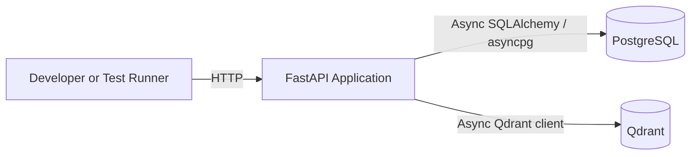
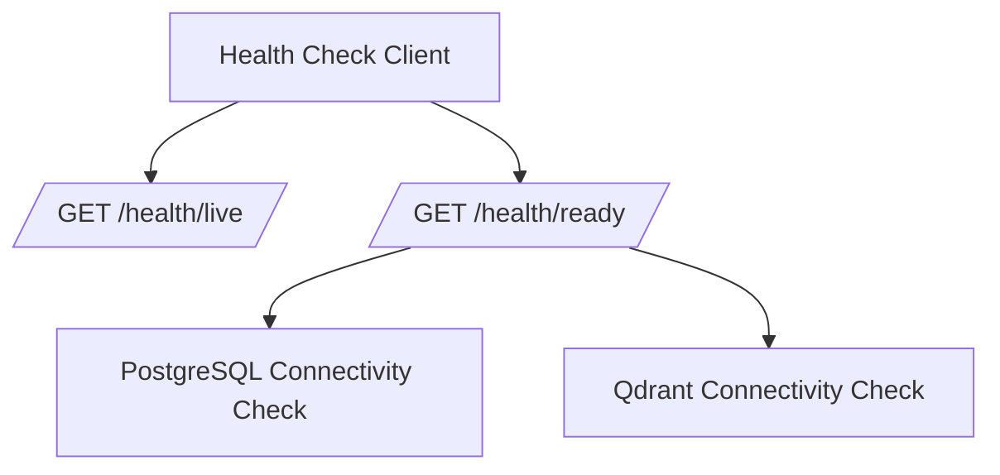
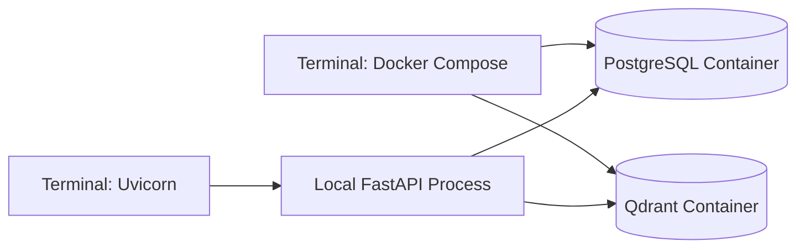
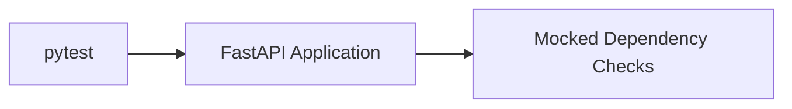
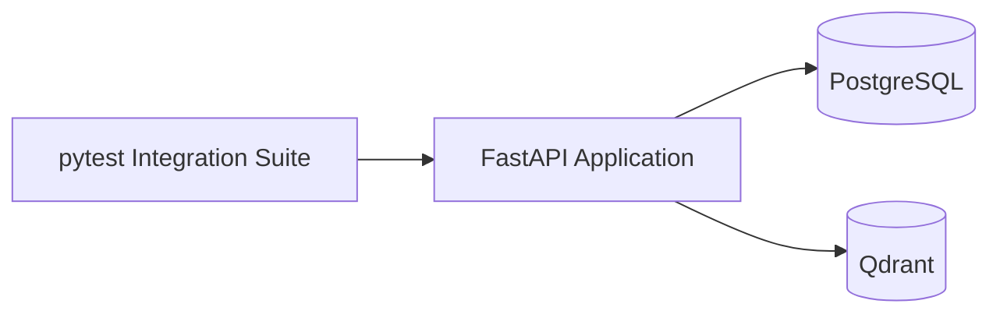
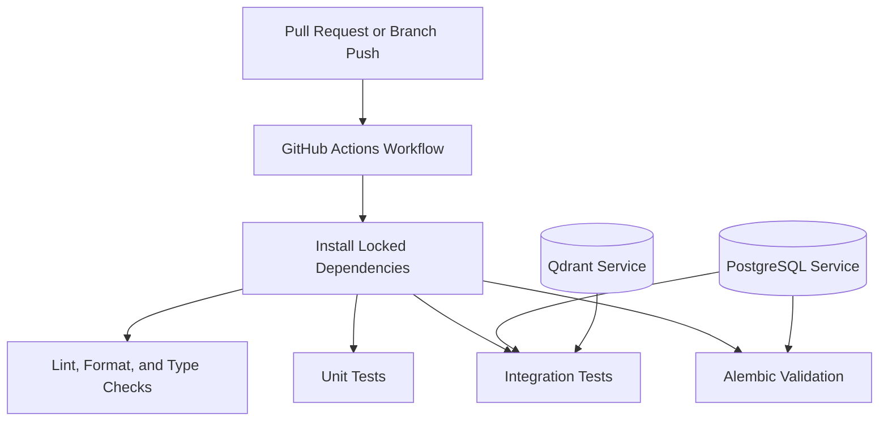
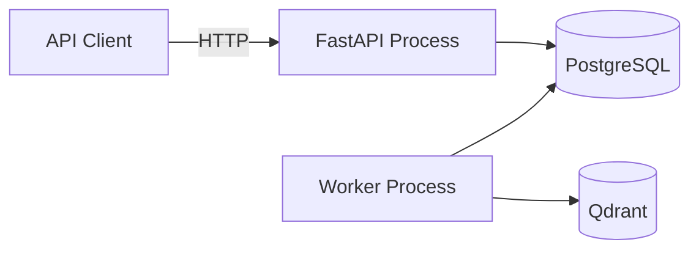

# Runtime Topology

## Purpose

This document describes the intended runtime topology of SupportOps AI Platform for the repository foundation phase and the planned evolution toward separate API and worker processes.

The current topology is intentionally small. It provides the minimum operational foundation required for reliable local development, testing, and future platform growth without introducing premature distributed infrastructure.

## Current runtime components

The repository foundation is designed around three runtime components:

- the FastAPI application process;
- PostgreSQL;
- Qdrant.

The application process is expected to start independently from Docker Compose during the default local development workflow.

Docker Compose is responsible for local infrastructure services:

- PostgreSQL;
- Qdrant.

This separation keeps the application development loop fast while preserving reproducible infrastructure startup.

## FastAPI application process

The FastAPI process owns:

- application construction;
- OpenAPI metadata;
- router composition;
- structured logging setup;
- application startup and shutdown;
- PostgreSQL engine lifecycle;
- Qdrant client lifecycle;
- liveness and readiness endpoints.

The process is expected to run through Uvicorn.

The application may remain alive when PostgreSQL or Qdrant is unavailable. Dependency availability is represented through readiness rather than process termination.

Invalid required configuration remains a startup error.

## PostgreSQL runtime role

PostgreSQL is the transactional source of truth for the platform.

During the repository foundation phase, PostgreSQL is used only to establish:

- local service provisioning;
- connection configuration;
- async engine initialization;
- connection lifecycle;
- connectivity validation;
- Alembic compatibility.

No business tables are created.

Future phases are expected to use PostgreSQL for:

- support operations state;
- workflow state;
- approvals;
- audit records;
- usage events;
- asynchronous job state.

## Qdrant runtime role

Qdrant is a rebuildable retrieval index.

During the repository foundation phase, Qdrant is used only to establish:

- local service provisioning;
- client configuration;
- client lifecycle;
- connectivity validation.

No collections, vectors, embeddings, ingestion workflows, or retrieval behavior are created.

Future retrieval data must remain reproducible from authoritative source content.

## Application lifecycle

The application lifecycle is explicit.

### Startup

Application startup performs local construction tasks such as:

- loading and validating settings;
- configuring structured logging;
- creating infrastructure clients;
- preparing shared application state.

Client construction does not imply dependency availability.

The application does not require PostgreSQL or Qdrant to be reachable merely to expose liveness and diagnostic readiness behavior.

### Runtime

During runtime:

- liveness verifies that the process is responsive;
- readiness performs bounded connectivity checks;
- API routes use explicitly composed dependencies;
- infrastructure failures are logged without exposing credentials.

### Shutdown

Application shutdown releases owned resources:

- the SQLAlchemy async engine is disposed;
- the Qdrant client is closed;
- shutdown failures are logged with exception context.

Lifecycle ownership must remain centralized and predictable.

## Health topology

The health model separates process health from dependency readiness.

### Liveness

`GET /health/live` verifies that the application process can respond.

It does not call PostgreSQL or Qdrant.

A dependency outage must not cause liveness to fail.

### Readiness

`GET /health/ready` verifies whether required dependencies are available.

The readiness response aggregates:

- PostgreSQL status;
- Qdrant status.

Each dependency check has a bounded timeout.

If any required dependency is unavailable, timed out, or returns an unexpected failure:

- readiness returns a structured unhealthy result;
- the HTTP response uses a non-success status;
- the failing dependency is identified;
- credentials and full connection strings are not returned.

## Local development topology

The default local workflow is:

Expected execution model:

1. install dependencies with `uv`;
2. create a local environment file;
3. start PostgreSQL and Qdrant with Docker Compose;
4. start the FastAPI process with `uv run`;
5. call liveness and readiness endpoints;
6. run local quality and test commands.

The application is not required to run inside Docker Compose for the primary development loop.

## Test topology

### Unit tests

Unit tests run without network services.

Unit tests validate:

- settings behavior;
- application construction;
- liveness;
- readiness aggregation;
- dependency failure responses.

### Integration tests

Integration tests use live PostgreSQL and Qdrant services.

Integration tests validate:

- real PostgreSQL connectivity;
- real Qdrant connectivity;
- readiness success;
- readiness failure;
- Alembic configuration.

## Continuous integration topology

The initial GitHub Actions workflow is expected to use Python 3.12 and dependency installation from the committed lockfile.

The workflow is expected to provide PostgreSQL and Qdrant services for integration validation.

The initial workflow intentionally avoids a runtime matrix because Python 3.12 is the supported platform version.

## Future API and worker topology

A later phase will introduce a separate asynchronous worker process.

The API and worker will:

- run as separate operating system processes;
- import the same `supportops` Python package;
- use the same application services and domain model;
- use the same PostgreSQL database;
- use shared infrastructure adapters;
- maintain independent process lifecycle and connection pools.

The worker will not be implemented until job ownership, claiming, concurrency, retry, and idempotency behavior are defined.

## Process separation implications

When the API and worker become separate processes:

- each process will create and dispose its own database engine;
- each process will own its own Qdrant client where required;
- in-memory state will not be shared;
- configuration will be loaded independently;
- logging context will be process-specific;
- connection pool sizing must account for combined process concurrency;
- graceful shutdown must be implemented independently;
- database state will coordinate durable work;
- process crashes must not lose authoritative workflow state.

Shared Python code does not imply shared runtime memory.

## Failure scenarios

### Invalid configuration

Missing or invalid required configuration prevents application construction.

The failure should be explicit and must not expose secret values.

### PostgreSQL unavailable

Expected behavior:

- the process may start;
- liveness remains healthy;
- PostgreSQL readiness reports unhealthy;
- overall readiness returns a non-success status;
- the failure is logged safely.

### Qdrant unavailable

Expected behavior:

- the process may start;
- liveness remains healthy;
- Qdrant readiness reports unhealthy;
- overall readiness returns a non-success status;
- the failure is logged safely.

### Dependency timeout

A slow dependency check must terminate within the configured health-check timeout.

The readiness response reports the dependency as unhealthy without waiting indefinitely.

### Shutdown failure

A resource cleanup failure must be logged with exception information.

Shutdown handling should continue attempting to release other owned resources where safe.

## Network and security boundaries

The local topology is intended for development and CI.

Before public production deployment, the platform will require additional decisions for:

- transport encryption;
- managed secret storage;
- private network boundaries;
- database access restrictions;
- Qdrant authentication and network isolation;
- production process supervision;
- resource limits;
- deployment health probes;
- authentication and authorization;
- tenant isolation;
- backup and recovery;
- centralized telemetry.

These concerns are intentionally outside the repository foundation phase.

## Intentionally excluded runtime components

The current topology excludes:

- Redis;
- Celery;
- Kafka;
- SQS;
- EventBridge;
- Langfuse self-hosting;
- OpenTelemetry collectors;
- Prometheus;
- Grafana;
- frontend services;
- Kubernetes;
- cloud load balancers;
- managed cloud databases;
- ingestion workers;
- AI provider calls.

These components will not be introduced until a concrete capability and operational requirement justify them.
