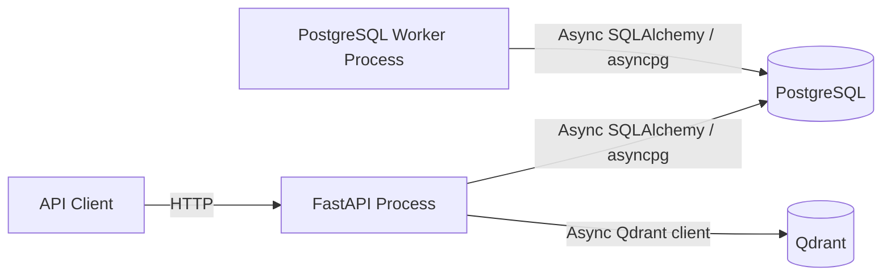
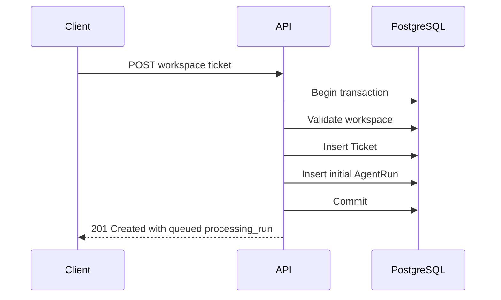
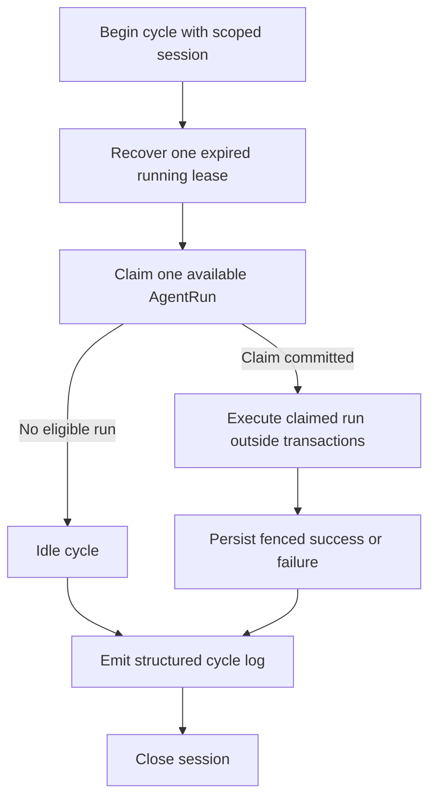
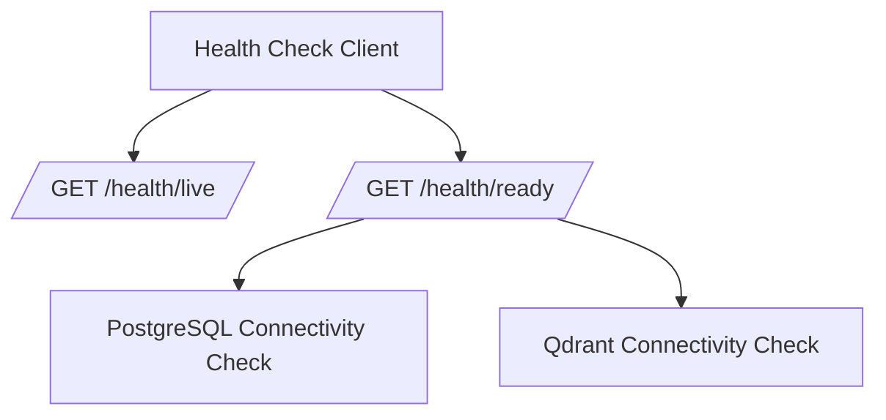
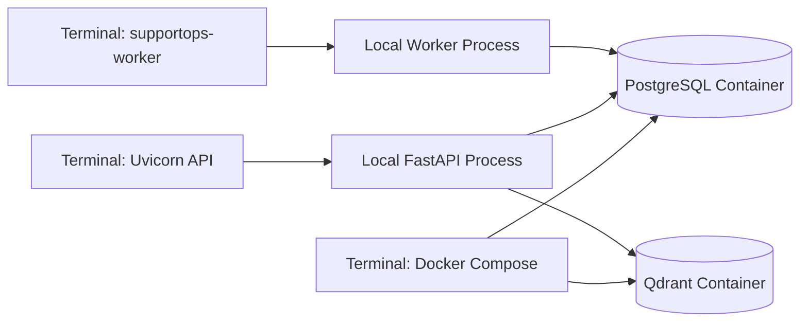
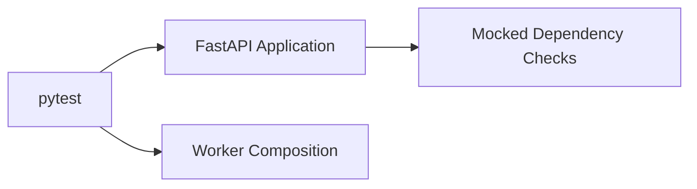
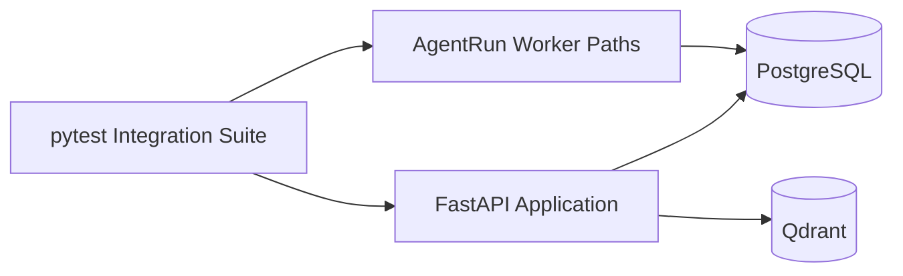
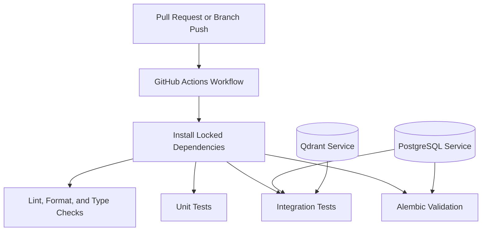

# Runtime Topology

## Purpose

This document describes the runtime topology of SupportOps AI Platform for the current foundation, Slice 1 workspace and ticket API, durable AgentRun scheduling, and PostgreSQL worker phase.

The topology is intentionally small. It provides the operational foundation required for reliable local development, testing, and controlled asynchronous processing without introducing premature distributed infrastructure.

## Current runtime components

The current runtime is designed around four components:

- the FastAPI application process;
- the PostgreSQL AgentRun worker process;
- PostgreSQL;
- Qdrant.



The API and worker processes start independently from Docker Compose during the default local development workflow.

Docker Compose is responsible for local infrastructure services:

- PostgreSQL;
- Qdrant.

A worker service is intentionally not added to Docker Compose in this phase. This separation keeps the application and worker development loops explicit while preserving reproducible infrastructure startup.

## FastAPI process

The FastAPI process owns:

- application construction;
- OpenAPI metadata;
- router composition;
- structured logging setup;
- application startup and shutdown;
- PostgreSQL engine lifecycle;
- Qdrant client lifecycle;
- HTTP request context middleware;
- trace response headers;
- liveness and readiness endpoints;
- versioned `/api/v1` business routes;
- stable expected-error handlers;
- atomic Ticket and initial AgentRun scheduling during ticket intake.

The process is expected to run through Uvicorn.

The application may remain alive when PostgreSQL or Qdrant is unavailable. Dependency availability is represented through readiness rather than process termination.

Invalid required configuration remains a startup error.

Business routes persist and query PostgreSQL. Ticket creation schedules a durable AgentRun in the same application-owned transaction. The API does not claim runs, acquire leases, execute workflows, or recover stale ownership. Business routes do not call Qdrant.

## Worker process

The worker is a separate Python process exposed through the `supportops-worker` project script.

The worker process owns:

- loading and validating shared settings at process startup;
- creating a process-owned PostgreSQL engine and session factory;
- resolving configured or generated worker identity;
- composing the deterministic baseline executor and retry policy;
- running continuous recovery, claim, and processing cycles;
- emitting structured operational cycle logs;
- cooperative SIGINT and SIGTERM shutdown;
- disposing the SQLAlchemy engine on exit.

The worker uses PostgreSQL as its durable work queue and source of truth. It does not initialize or depend on Qdrant.

Worker identity may be configured through `SUPPORTOPS_WORKER_ID` or generated from hostname, process ID, and a UUID suffix.

## PostgreSQL runtime role

PostgreSQL is the transactional source of truth and the durable AgentRun work queue.

PostgreSQL currently owns:

- local service provisioning;
- connection configuration;
- async engine initialization for API and worker processes;
- process-owned engine and session factory lifecycles;
- connectivity validation for the API readiness path;
- Alembic migrations;
- `workspaces` and `tickets` tables;
- `agent_runs` and `agent_run_attempts` tables;
- the workspace ownership foreign key on tickets;
- composite workspace and ticket ownership for AgentRun records;
- uniqueness constraints for workspace slugs and workspace-scoped external references;
- unique initial trigger enforcement for AgentRun scheduling;
- the workspace-leading ticket listing index;
- claim and recovery indexes and row-lock coordination;
- lease ownership, retry scheduling, and attempt history.

Repository operations use request-scoped async sessions for business HTTP routes. The worker opens one new `AsyncSession` per polling cycle. Engines and session factories remain process-owned.

Each API request receives one async SQLAlchemy session. Route dependencies construct repositories and application services explicitly from that session. Command use cases, including `CreateTicketWithInitialRun`, commit through the application-owned transaction adapter.

Business routes do not call Qdrant. Qdrant remains limited to API readiness connectivity checks in the current phase.

Future phases may extend PostgreSQL ownership for:

- approvals;
- audit records;
- usage events.

## Session and transaction lifetimes

### API process

- the SQLAlchemy engine and session factory are process-owned;
- each HTTP request receives one request-scoped async session;
- write commands open short application-owned transactions;
- ticket intake commits both the Ticket and initial AgentRun before the HTTP response returns;
- transactions do not span HTTP client waits beyond the request.

### Worker process

- the SQLAlchemy engine and session factory are process-owned and independent from the API process;
- each polling cycle opens one new `AsyncSession` and closes it when the cycle completes;
- recovery uses one short transaction;
- claim uses one short transaction that commits before executor work begins;
- ticket loading uses one short transaction;
- fenced success or failure persistence uses one short transaction;
- executor work runs outside database transactions;
- idle waits do not hold open transactions.

## Qdrant runtime role

Qdrant is a rebuildable retrieval index.

During the current phase, Qdrant is used only to establish:

- local service provisioning;
- client configuration for the API process;
- client lifecycle for the API process;
- connectivity validation through API readiness.

No collections, vectors, embeddings, ingestion workflows, or retrieval behavior are created.

Qdrant is not involved in workspace, ticket, or AgentRun persistence. The worker must not connect to Qdrant. Ticket ownership, uniqueness, listing, repository behavior, AgentRun scheduling, claiming, and execution are PostgreSQL concerns only.

Future retrieval data must remain reproducible from authoritative source content.

## Request flow for ticket creation



Ticket acceptance and asynchronous processing success are separate outcomes. The API returns after the scheduling transaction commits. The HTTP request does not execute the workflow. The response includes a minimal `processing_run` projection with status `queued`.

## Worker cycle flow

Each worker cycle:

1. opens one scoped session;
2. attempts expired lease recovery;
3. attempts to claim one available AgentRun;
4. if no claim is available, reports an idle cycle and sleeps interruptibly;
5. if a claim succeeds, processes the claimed run outside the claim transaction;
6. emits a structured cycle completion log;
7. closes the session.

The worker processes at most one claimed run per cycle. It sleeps only after an idle cycle. Delivery semantics are at-least-once execution.



## Claim transaction

Eligible claim states are:

```text
queued
retry_scheduled
```

Claim eligibility also requires:

- `available_at` due at claim time;
- `attempt_count` below `max_attempts`.

Deterministic claim ordering is:

```text
available_at ASC, created_at ASC, id ASC
```

PostgreSQL `FOR UPDATE SKIP LOCKED` allows multiple worker processes to claim distinct runs safely.

A successful claim:

- changes the run to `running`;
- increments `attempt_count`;
- creates an `AgentRunAttempt`;
- assigns a lease owner, lease token, and lease expiry;
- commits before executor work begins.

## Executor outside transaction

The current executor is `deterministic-ticket-processing`.

The persisted workflow contract is:

```text
workflow_name = ticket-processing
workflow_version = deterministic-baseline-v1
trigger_key = initial-ticket-processing
```

The deterministic baseline validates that contract and performs no external I/O, LLM call, retrieval, or ticket classification. It exists to validate the durable execution architecture independently from future AI behavior.

After the claim transaction commits:

1. the processor loads the ticket in a short transaction;
2. the executor runs outside database transactions under a bounded timeout;
3. typed retryable and terminal failures are handled explicitly;
4. unexpected exceptions become sanitized retryable failures;
5. raw exception text is not persisted;
6. success or failure is persisted in a separate fenced transaction.

## Fenced completion transaction

Outcome persistence uses lease-token fencing.

Successful completion:

- changes the run to `succeeded`;
- closes the active attempt with outcome `succeeded`;
- clears previous safe error details;
- clears lease ownership.

Retryable failures and timeouts are retried only while attempt budget remains. Retry scheduling uses bounded exponential backoff and moves the run to `retry_scheduled` with a future `available_at`.

Terminal failures and exhausted retryable failures change the run to `failed`.

Attempt outcomes used by the worker include:

```text
succeeded
retryable_failure
terminal_failure
timed_out
lease_expired
```

A repeated or stale completion returns `lease_lost` and does not modify the current state. Exactly-once execution is not claimed. Future executors and tools must make side effects idempotent or otherwise safely fenced.

## Expired lease recovery

Every worker cycle attempts recovery before claiming available work.

Recovery:

- selects expired `running` runs using deterministic ordering and `FOR UPDATE SKIP LOCKED`;
- closes the abandoned attempt with outcome `lease_expired`;
- does not increment `attempt_count`;
- does not create a new attempt;
- returns a recoverable run to `retry_scheduled` with a future `available_at`;
- marks an exhausted run as `failed`.

Recovery and claim remain separate operations.

## Graceful shutdown

SIGINT and SIGTERM request cooperative shutdown.

Shutdown behavior:

- the idle wait is interruptible;
- the active cycle may finish within the configured shutdown grace period;
- the loop task is cancelled when the grace period is exceeded;
- the SQLAlchemy engine is disposed during shutdown;
- structured logs record shutdown request, grace exceeded, and stop events.

## Application lifecycle

The API application lifecycle is explicit.

### Startup

Application startup performs local construction tasks such as:

- loading and validating settings;
- configuring structured logging;
- creating infrastructure clients;
- preparing shared application state.

Client construction does not imply dependency availability.

The application does not require PostgreSQL or Qdrant to be reachable merely to expose liveness and diagnostic readiness behavior.

### Runtime

During runtime:

- liveness verifies that the process is responsive;
- readiness performs bounded connectivity checks;
- API routes use explicitly composed dependencies;
- infrastructure failures are logged without exposing credentials.

Each HTTP request follows this flow:

1. request context middleware generates a request ID and resolves a sanitized correlation ID;
2. the middleware binds context for the request;
3. FastAPI provides a request-scoped async PostgreSQL session;
4. route dependencies construct repositories and application services explicitly;
5. the application use case executes;
6. command use cases open a PostgreSQL transaction through the application-owned adapter;
7. the route maps domain results to response schemas;
8. the middleware attaches `X-Request-ID` and `X-Correlation-ID` response headers;
9. the middleware emits one structured completion event;
10. context is reset in a finally path.

The request context is in-process and task-local.

The engine and session factory are process-owned. Sessions are request-scoped.

Business routes under `/api/v1` schedule durable AgentRun records during ticket intake and do not call Qdrant. Worker claim, lease, retry, recovery, and execution behavior run in the separate worker process.

### Route versioning

Business routes are versioned:

```text
/api/v1/workspaces
/api/v1/workspaces/{workspace_id}
/api/v1/workspaces/{workspace_id}/tickets
/api/v1/workspaces/{workspace_id}/tickets/{ticket_id}
```

Operational health routes remain unversioned:

```text
GET /health/live
GET /health/ready
```

### Shutdown

Application shutdown releases owned resources:

- the SQLAlchemy async engine is disposed;
- the Qdrant client is closed;
- shutdown failures are logged with exception context.

Lifecycle ownership must remain centralized and predictable.

## HTTP request traceability

HTTP request traceability is handled by middleware in the FastAPI process.

Behavior:

- `X-Request-ID` is always generated by this service;
- inbound `X-Request-ID` is ignored;
- `X-Correlation-ID` is accepted only as a valid UUID;
- invalid or missing correlation values fall back to the request ID;
- route templates are preferred in completion logs;
- concrete unmatched paths are sanitized and bounded;
- unexpected exceptions retain safe `500` behavior and still return trace response headers;
- the middleware does not log request bodies or raw external header values.

Request context is bound for the duration of the request and reset after completion.

## Health topology

The health model separates process health from dependency readiness for the API process.



### Liveness

`GET /health/live` verifies that the application process can respond.

It does not call PostgreSQL or Qdrant.

A dependency outage must not cause liveness to fail.

### Readiness

`GET /health/ready` verifies whether required dependencies are available.

The readiness response aggregates:

- PostgreSQL status;
- Qdrant status.

Each dependency check has a bounded timeout.

If any required dependency is unavailable, timed out, or returns an unexpected failure:

- readiness returns a structured unhealthy result;
- the HTTP response uses a non-success status;
- the failing dependency is identified;
- credentials and full connection strings are not returned.

The worker does not expose these health endpoints and does not require Qdrant.

## Local development topology

The default local workflow uses three terminals:



Expected execution model:

1. install dependencies with `uv`;
2. create a local environment file;
3. start PostgreSQL and Qdrant with Docker Compose;
4. apply the current Alembic migration head;
5. start the FastAPI process with `uv run`;
6. start the worker with `uv run supportops-worker`;
7. create a ticket through the API and observe a queued `processing_run`;
8. observe structured worker cycle logs;
9. stop the worker with Ctrl+C and verify graceful shutdown logs;
10. run local quality and test commands.

Docker Compose intentionally does not run the worker.

## Multi-worker safety

Multiple worker processes may run concurrently against the same PostgreSQL database.

Safety properties:

- claim and recovery use `FOR UPDATE SKIP LOCKED`;
- distinct workers claim distinct runs;
- lease-token fencing rejects stale completions;
- delivery semantics remain at-least-once execution;
- process crashes leave recoverable lease state in PostgreSQL.

Shared Python code does not imply shared runtime memory.

## Test topology

### Unit tests

Unit tests run without network services.



Unit tests validate:

- settings behavior, including worker timing invariants;
- application construction;
- request-context creation and cleanup;
- async-task isolation;
- response trace headers;
- correlation propagation and invalid-value fallback;
- incoming request-ID rejection;
- downstream trace-header spoofing prevention;
- request completion logging;
- unexpected exception behavior with retained trace headers;
- liveness;
- readiness aggregation;
- dependency failure responses;
- application service command and query behavior;
- AgentRun domain invariants;
- transactional ticket-intake orchestration;
- retry policy, claim contracts, fencing, recovery, processor, and worker cycles;
- deterministic executor behavior;
- worker identity and graceful shutdown;
- workspace and ticket API schemas;
- opaque cursor encoding.

### Integration tests

Integration tests use live PostgreSQL and Qdrant services.



Integration tests validate:

- real PostgreSQL connectivity;
- real Qdrant connectivity;
- readiness success;
- readiness failure;
- Alembic upgrade, downgrade, re-upgrade, and metadata parity;
- workspace repository persistence;
- ticket repository persistence and workspace scoping;
- concurrency-sensitive uniqueness enforcement;
- atomic ticket and AgentRun commit and rollback behavior;
- PostgreSQL claim ordering and `SKIP LOCKED` concurrency;
- fenced transitions and expired lease recovery;
- processor transaction separation;
- workspace and ticket HTTP API behavior;
- stable expected-error responses;
- opaque cursor pagination.

Qdrant-dependent tests are not worker tests. PostgreSQL integration coverage is required for concurrency and row-locking behavior.

## Continuous integration topology

The initial GitHub Actions workflow is expected to use Python 3.12 and dependency installation from the committed lockfile.

The workflow is expected to provide PostgreSQL and Qdrant services for integration validation.



The initial workflow intentionally avoids a runtime matrix because Python 3.12 is the supported platform version.

## Process separation implications

The API and worker run as separate processes:

- each process creates and disposes its own database engine;
- only the API owns a Qdrant client in the current phase;
- in-memory state is not shared;
- configuration is loaded independently;
- logging context is process-specific;
- connection pool sizing must account for combined process concurrency;
- graceful shutdown is implemented independently;
- database state coordinates durable work;
- process crashes must not lose authoritative workflow state.

Ticket intake persists request and correlation identifiers on both the ticket and its initial AgentRun. Worker execution preserves the run correlation identifier while generating a separate execution request identifier for each claimed attempt.

## Failure scenarios

### Invalid configuration

Missing or invalid required configuration prevents application or worker construction.

The failure should be explicit and must not expose secret values.

Worker construction also rejects invalid timing relationships:

- lease duration must exceed execution timeout by at least five seconds;
- retry maximum must not be smaller than retry base.

### PostgreSQL unavailable

Expected API behavior:

- the process may start;
- liveness remains healthy;
- PostgreSQL readiness reports unhealthy;
- overall readiness returns a non-success status;
- the failure is logged safely.

Expected worker behavior:

- the worker depends on PostgreSQL for recovery, claim, and outcome persistence;
- unavailable PostgreSQL surfaces as a runtime failure through the worker process path.

### Qdrant unavailable

Expected API behavior:

- the process may start;
- liveness remains healthy;
- Qdrant readiness reports unhealthy;
- overall readiness returns a non-success status;
- the failure is logged safely.

The worker does not require Qdrant.

### Dependency timeout

A slow API dependency check must terminate within the configured health-check timeout.

The readiness response reports the dependency as unhealthy without waiting indefinitely.

### Shutdown failure

A resource cleanup failure must be logged with exception information.

Shutdown handling should continue attempting to release other owned resources where safe.

## Network and security boundaries

The local topology is intended for development and CI.

Trace identifiers support observability and supportability. They do not establish caller identity, authorization, or tenant isolation.

Before public production deployment, the platform will require additional decisions for:

- transport encryption;
- managed secret storage;
- private network boundaries;
- database access restrictions;
- Qdrant authentication and network isolation;
- production process supervision;
- resource limits;
- deployment health probes;
- authentication and authorization;
- tenant isolation;
- backup and recovery;
- centralized telemetry.

These concerns are intentionally outside the current implementation phase.

## Intentionally excluded runtime components

The current topology excludes:

- Redis;
- Celery;
- Kafka;
- SQS;
- EventBridge;
- Langfuse self-hosting;
- OpenTelemetry collectors;
- Prometheus;
- Grafana;
- frontend services;
- Kubernetes;
- cloud load balancers;
- managed cloud databases;
- a Docker Compose worker service;
- ingestion workers;
- AI provider calls.

These components are not introduced until a concrete capability and operational requirement justify them. Redis, Celery, Kafka, and SQS remain intentionally deferred because PostgreSQL provides transactional durability and adequate local and portfolio scope for this phase.
