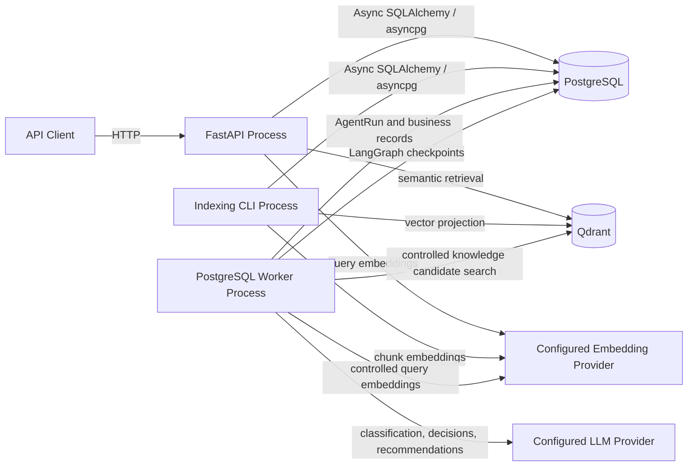
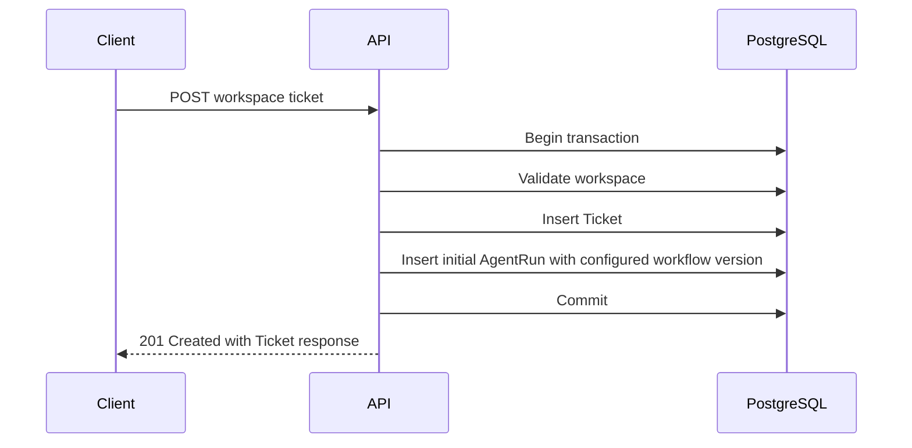
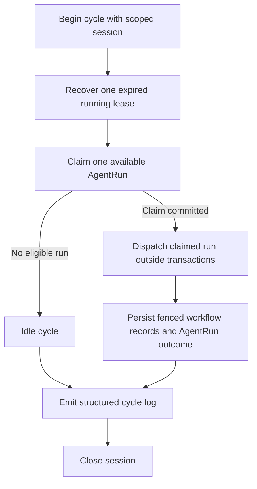
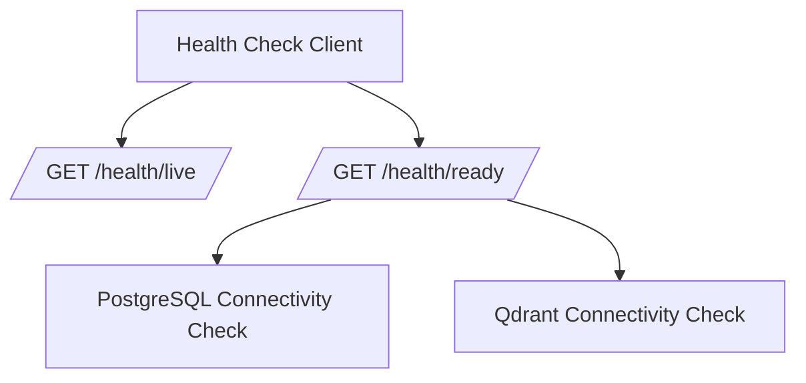
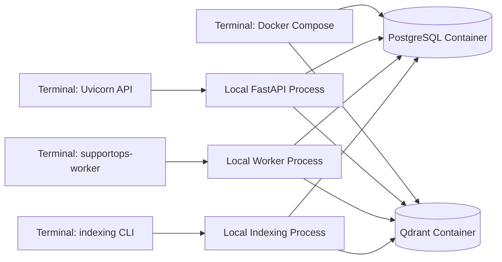
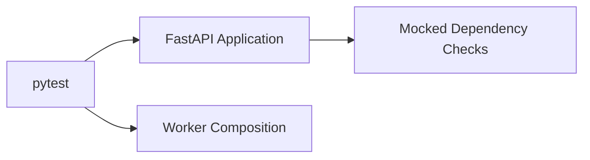
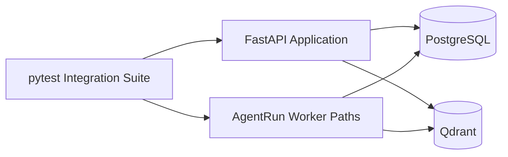
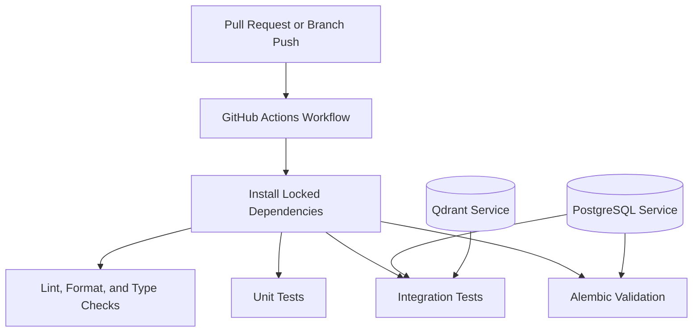

# Runtime Topology

## Purpose

This document describes the runtime topology of SupportOps AI Platform for the current foundation, Slice 1 workspace and ticket API, durable AgentRun scheduling, PostgreSQL worker, application-owned LLM Gateway, durable ticket classification, explicit knowledge indexing, semantic knowledge retrieval, and the controlled support workflow.

The topology is intentionally small. It provides the operational foundation required for reliable local development, testing, and controlled asynchronous processing without introducing premature distributed infrastructure.

Controlled workflow behavior is documented in [`controlled-support-workflow.md`](controlled-support-workflow.md).

## Current runtime components

The current runtime is designed around these components:

- the FastAPI application process;
- the PostgreSQL AgentRun worker process;
- the one-shot `supportops-index-knowledge` indexing process;
- PostgreSQL, used for business records and for LangGraph checkpoint storage;
- Qdrant;
- the configured embedding provider, owned independently by API retrieval, the worker, and the indexing command;
- the configured LLM provider used only by the worker.



The worker may use the deterministic mock LLM provider with no network, or the OpenAI LLM provider over HTTPS. The API does not use the LLM provider.

The worker reaches PostgreSQL through two separate connection paths: the SQLAlchemy engine used for AgentRun and business records, and the LangGraph checkpoint pool used for graph durability. The worker also owns its own embedding provider and Qdrant client for the controlled `search_knowledge` tool. The API keeps its own embedding provider and Qdrant client for the public semantic search endpoint, and the indexing CLI keeps its own for chunk embeddings and vector projection writes. These resources are not shared between processes.

The API and worker processes start independently from Docker Compose during the default local development workflow.

Docker Compose is responsible for local infrastructure services:

- PostgreSQL;
- Qdrant.

A worker service is intentionally not added to Docker Compose in this phase. This separation keeps the application and worker development loops explicit while preserving reproducible infrastructure startup.

## FastAPI process

The FastAPI process owns:

- application construction;
- OpenAPI metadata;
- router composition;
- structured logging setup;
- application startup and shutdown;
- PostgreSQL engine and session factory lifecycle;
- Qdrant client lifecycle;
- process-scoped embedding provider construction for semantic retrieval;
- process-scoped immutable retrieval profile;
- HTTP request context middleware;
- trace response headers;
- liveness and readiness endpoints;
- versioned `/api/v1` business routes;
- stable expected-error handlers;
- atomic Ticket and initial AgentRun scheduling during ticket intake;
- the workspace-scoped semantic search endpoint;
- active-version resolution, Qdrant candidate search, and PostgreSQL hydration for retrieval;
- provider and Qdrant cleanup on shutdown, including partial startup cleanup.

The process is expected to run through Uvicorn.

The application may remain alive when PostgreSQL or Qdrant is unavailable. Dependency availability is represented through readiness rather than process termination.

Invalid required configuration remains a startup error.

Business routes persist and query PostgreSQL. Ticket creation schedules a durable AgentRun with the configured workflow version in the same application-owned transaction. The API does not claim runs, acquire leases, execute workflows, recover stale ownership, or call the LLM. Semantic search routes use Qdrant for candidate search and the configured embedding provider for request-driven query embeddings. The API does not perform indexing.

## Worker process

The worker is a separate Python process exposed through the `supportops-worker` project script.

The worker process owns:

- loading and validating shared settings at process startup;
- creating a process-owned SQLAlchemy engine and session factory;
- creating one process-scoped LLM runtime with a mock or OpenAI provider and one LLM Gateway;
- creating one process-scoped PostgreSQL checkpoint runtime for LangGraph;
- creating one process-scoped embedding provider;
- creating one process-scoped Qdrant client;
- building one immutable knowledge index profile;
- creating one Qdrant knowledge vector store and search adapter;
- resolving configured or generated worker identity;
- composing a session-scoped executor registry with three registered workflow versions, plus classification, tool, and recommendation repositories per cycle;
- running continuous recovery, claim, and processing cycles;
- emitting structured operational cycle logs;
- cooperative SIGINT and SIGTERM shutdown;
- closing the controlled runtime, closing the LLM runtime, and disposing the SQLAlchemy engine on exit.

Provider, Gateway, checkpoint, embedding, and Qdrant resources are process-scoped and reused across cycles. The worker uses PostgreSQL as its durable work queue and business source of truth, and the same PostgreSQL instance stores LangGraph checkpoints through a separate connection pool. The worker now initializes Qdrant because controlled workflows may execute knowledge search.

Worker identity may be configured through `SUPPORTOPS_WORKER_ID` or generated from hostname, process ID, and a UUID suffix.

## PostgreSQL runtime role

PostgreSQL is the transactional source of truth and the durable AgentRun work queue.

PostgreSQL currently owns:

- local service provisioning;
- connection configuration;
- async engine initialization for API and worker processes;
- process-owned engine and session factory lifecycles;
- connectivity validation for the API readiness path;
- Alembic migrations;
- `workspaces` and `tickets` tables;
- `agent_runs` and `agent_run_attempts` tables;
- `llm_invocations` and `ticket_classifications` tables;
- `agent_tool_calls`, `support_recommendations`, and `support_recommendation_citations` tables;
- framework-owned LangGraph checkpoint tables created by checkpointer setup rather than by application migrations;
- the workspace ownership foreign key on tickets;
- composite workspace and ticket ownership for AgentRun, invocation, and classification records;
- uniqueness constraints for workspace slugs and workspace-scoped external references;
- unique initial trigger enforcement for AgentRun scheduling;
- one invocation sequence per AgentRunAttempt;
- one accepted classification per AgentRun with accepted-invocation provenance;
- token usage and estimated-cost provenance on invocation records;
- the workspace-leading ticket listing index;
- claim and recovery indexes and row-lock coordination;
- lease ownership, retry scheduling, and attempt history.

Repository operations use request-scoped async sessions for business HTTP routes. The worker opens one new `AsyncSession` per polling cycle. Engines and session factories remain process-owned. The LangGraph checkpoint pool is process-scoped and independent from the SQLAlchemy engine; Alembic autogenerate excludes the exact framework-owned checkpoint tables and their indexes from application schema comparison.

Each API request receives one async SQLAlchemy session. Route dependencies construct repositories and application services explicitly from that session. Command use cases, including `CreateTicketWithInitialRun`, commit through the application-owned transaction adapter. Semantic search constructs a request-scoped retrieval service over the same session while reusing the process-scoped embedding provider, Qdrant client, and immutable retrieval profile.

PostgreSQL remains authoritative for retrieval content and active-version scope. Future phases may extend PostgreSQL ownership for:

- approvals;
- audit records;
- operational cost reporting.

## Session and transaction lifetimes

### API process

- the SQLAlchemy engine and session factory are process-owned;
- each HTTP request receives one request-scoped async session;
- write commands open short application-owned transactions;
- ticket intake commits both the Ticket and initial AgentRun before the HTTP response returns;
- transactions do not span HTTP client waits beyond the request.

### Worker process

- the SQLAlchemy engine and session factory are process-owned and independent from the API process;
- the configured provider, LLM Gateway, checkpoint runtime, embedding provider, and Qdrant client are process-owned and reused across cycles;
- the LangGraph checkpoint connection pool is process-scoped and separate from the SQLAlchemy engine;
- each polling cycle opens one new `AsyncSession` and closes it when the cycle completes;
- recovery uses one short transaction;
- claim uses one short transaction that commits before executor work begins;
- ticket loading uses one short transaction;
- existing-classification, tool-audit, and recommendation recovery lookups each use one short transaction;
- provider, embedding, tool, and Qdrant work runs outside business transactions;
- fenced invocation and classification persistence uses one short transaction;
- fenced tool-call audit persistence uses one short transaction per call;
- fenced recommendation and citation persistence uses one short atomic transaction;
- fenced AgentRun success or failure persistence uses a separate short transaction;
- idle waits do not hold open transactions.

Checkpoint writes occur at graph node boundaries through the checkpoint pool. They are not part of the application business transactions listed above.

## Qdrant runtime role

Qdrant is a rebuildable retrieval index.

During the current phase, Qdrant is used for:

- local service provisioning;
- client configuration and lifecycle for the API process;
- separate client configuration and lifecycle for the worker process;
- connectivity validation through API readiness;
- verified vector-point projection written by the indexing CLI;
- filtered candidate search for API semantic retrieval;
- filtered candidate search for the controlled `search_knowledge` tool.

Qdrant returns candidate identifiers and selected metadata only. Authoritative chunk content is hydrated from PostgreSQL. Retrieval data must remain reproducible from authoritative source content. Graph resume reconstructs observations from PostgreSQL records rather than from Qdrant.

Qdrant is not involved in workspace, ticket, AgentRun, tool-audit, or recommendation persistence. Ticket ownership, uniqueness, listing, repository behavior, AgentRun scheduling, claiming, and execution are PostgreSQL concerns only. The API does not perform indexing; the indexing CLI owns its own Qdrant client for projection writes.

## Request flow for ticket creation



Ticket acceptance and asynchronous processing success are separate outcomes. The API returns the existing Ticket response after the scheduling transaction commits. The HTTP request does not execute the workflow or call the model. The response does not include a `processing_run` projection or classification result.

## Worker cycle flow

Each worker cycle:

1. opens one scoped session;
2. attempts expired lease recovery;
3. attempts to claim one available AgentRun;
4. if no claim is available, reports an idle cycle and sleeps interruptibly;
5. if a claim succeeds, processes the claimed run outside the claim transaction;
6. emits a structured cycle completion log;
7. closes the session.

The worker processes at most one claimed run per cycle. It sleeps only after an idle cycle. Delivery semantics are at-least-once execution.



## Claim transaction

Eligible claim states are:

```text
queued
retry_scheduled
```

Claim eligibility also requires:

- `available_at` due at claim time;
- `attempt_count` below `max_attempts`.

Deterministic claim ordering is:

```text
available_at ASC, created_at ASC, id ASC
```

PostgreSQL `FOR UPDATE SKIP LOCKED` allows multiple worker processes to claim distinct runs safely.

A successful claim:

- changes the run to `running`;
- increments `attempt_count`;
- creates an `AgentRunAttempt`;
- assigns a lease owner, lease token, and lease expiry;
- commits before executor work begins.

## Executor outside transaction

The worker dispatches exact workflow name and version through the session-scoped executor registry. No version fallback and no provider fallback exist.

The registry contains exactly three versions:

```text
ticket-processing / deterministic-baseline-v1
ticket-processing / ticket-classification-v1
ticket-processing / controlled-support-v1
```

The persisted initial workflow contract is:

```text
workflow_name = ticket-processing
workflow_version = configured value
trigger_key = initial-ticket-processing
```

The local default configured value is `controlled-support-v1`. The classification workflow and the deterministic baseline remain supported for historical or explicitly scheduled runs; the deterministic baseline performs no external I/O, LLM call, retrieval, or ticket classification.

After the claim transaction commits:

1. the processor loads the ticket in a short transaction;
2. the registry selects the executor for the stored workflow name and version;
3. the classification executor checks for an existing accepted classification;
4. when needed, the provider call runs outside database transactions under a bounded timeout;
5. invocation and classification records persist in a separate fenced transaction;
6. typed retryable and terminal failures are handled explicitly;
7. unexpected exceptions become sanitized retryable failures;
8. raw exception text is not persisted;
9. AgentRun success or failure is persisted in a separate fenced transaction.

A controlled run additionally executes the compiled LangGraph graph with the process-scoped checkpointer. The graph ensures the durable classification, recovers committed tool outcomes before requesting another decision, requests bounded decisions, executes validated read-only tools outside transactions, persists tool audits under lease fencing, drafts the recommendation, and persists the recommendation and citations atomically. An attempt retry may resume the same graph thread instead of repeating completed nodes. The graph never transitions the AgentRun; the processor still owns the fenced completion transaction, and success requires a persisted recommendation identity in validated graph state.

Unknown workflow or version values are terminal.

## Fenced completion transaction

Outcome persistence uses lease-token fencing.

Successful completion:

- changes the run to `succeeded`;
- closes the active attempt with outcome `succeeded`;
- clears previous safe error details;
- clears lease ownership.

Retryable failures and timeouts are retried only while attempt budget remains. Retry scheduling uses bounded exponential backoff and moves the run to `retry_scheduled` with a future `available_at`.

Terminal failures and exhausted retryable failures change the run to `failed`.

Attempt outcomes used by the worker include:

```text
succeeded
retryable_failure
terminal_failure
timed_out
lease_expired
```

A repeated or stale completion returns `lease_lost` and does not modify the current state. Exactly-once execution is not claimed. Future executors and tools must make side effects idempotent or otherwise safely fenced.

## Expired lease recovery

Every worker cycle attempts recovery before claiming available work.

Recovery:

- selects expired `running` runs using deterministic ordering and `FOR UPDATE SKIP LOCKED`;
- closes the abandoned attempt with outcome `lease_expired`;
- does not increment `attempt_count`;
- does not create a new attempt;
- returns a recoverable run to `retry_scheduled` with a future `available_at`;
- marks an exhausted run as `failed`.

Recovery and claim remain separate operations.

## Graceful shutdown

SIGINT and SIGTERM request cooperative shutdown.

Shutdown behavior:

- the idle wait is interruptible;
- the active cycle may finish within the configured shutdown grace period;
- the loop task is cancelled when the grace period is exceeded;
- the controlled runtime is closed, releasing the checkpoint pool, the embedding provider, and the Qdrant client;
- the LLM runtime is closed;
- the SQLAlchemy engine is disposed;
- every independent cleanup operation is attempted even after an earlier cleanup failure;
- structured logs record shutdown request, grace exceeded, and stop events.

## Application lifecycle

The API application lifecycle is explicit.

### Startup

Application startup performs local construction tasks such as:

- loading and validating settings;
- configuring structured logging;
- creating the PostgreSQL engine and session factory;
- creating the Qdrant client;
- creating the configured embedding provider for semantic retrieval;
- preparing the immutable retrieval profile;
- preparing shared application state.

Client and provider construction does not imply dependency availability and performs no embedding request at startup. OpenAI embedding mode means API startup validates and constructs the client; query calls remain request-driven. There is no automatic provider fallback.

If startup fails after creating only some resources, partial cleanup closes what was constructed before the original failure propagates.

The application does not require PostgreSQL or Qdrant to be reachable merely to expose liveness and diagnostic readiness behavior.

### Runtime

During runtime:

- liveness verifies that the process is responsive;
- readiness performs bounded connectivity checks;
- API routes use explicitly composed dependencies;
- infrastructure failures are logged without exposing credentials.

Each HTTP request follows this flow:

1. request context middleware generates a request ID and resolves a sanitized correlation ID;
2. the middleware binds context for the request;
3. FastAPI provides a request-scoped async PostgreSQL session;
4. route dependencies construct repositories and application services explicitly;
5. the application use case executes;
6. command use cases open a PostgreSQL transaction through the application-owned adapter;
7. the route maps domain results to response schemas;
8. the middleware attaches `X-Request-ID` and `X-Correlation-ID` response headers;
9. the middleware emits one structured completion event;
10. context is reset in a finally path.

The request context is in-process and task-local.

The engine and session factory are process-owned. Sessions are request-scoped.

Business routes under `/api/v1` schedule durable AgentRun records during ticket intake and may call Qdrant for semantic candidate search. Worker claim, lease, retry, recovery, and execution behavior run in the separate worker process using its own PostgreSQL, checkpoint, embedding, and Qdrant resources.

### Route versioning

Business routes are versioned:

```text
/api/v1/workspaces
/api/v1/workspaces/{workspace_id}
/api/v1/workspaces/{workspace_id}/tickets
/api/v1/workspaces/{workspace_id}/tickets/{ticket_id}
```

Operational health routes remain unversioned:

```text
GET /health/live
GET /health/ready
```

### Shutdown

Application shutdown releases owned resources independently:

- the embedding provider is closed;
- the Qdrant client is closed;
- the SQLAlchemy async engine is disposed;
- shutdown failures are logged with exception context and without secrets.

Lifecycle ownership must remain centralized and predictable.

## HTTP request traceability

HTTP request traceability is handled by middleware in the FastAPI process.

Behavior:

- `X-Request-ID` is always generated by this service;
- inbound `X-Request-ID` is ignored;
- `X-Correlation-ID` is accepted only as a valid UUID;
- invalid or missing correlation values fall back to the request ID;
- route templates are preferred in completion logs;
- concrete unmatched paths are sanitized and bounded;
- unexpected exceptions retain safe `500` behavior and still return trace response headers;
- the middleware does not log request bodies or raw external header values.

Request context is bound for the duration of the request and reset after completion.

## Health topology

The health model separates process health from dependency readiness for the API process.



### Liveness

`GET /health/live` verifies that the application process can respond.

It does not call PostgreSQL or Qdrant.

A dependency outage must not cause liveness to fail.

### Readiness

`GET /health/ready` verifies whether required dependencies are available.

The readiness response aggregates:

- PostgreSQL status;
- Qdrant status.

Each dependency check has a bounded timeout.

If any required dependency is unavailable, timed out, or returns an unexpected failure:

- readiness returns a structured unhealthy result;
- the HTTP response uses a non-success status;
- the failing dependency is identified;
- credentials and full connection strings are not returned.

The worker does not expose these health endpoints. It requires PostgreSQL for every cycle, and it requires Qdrant and the embedding provider whenever a controlled workflow executes `search_knowledge`. Worker dependency problems surface as typed workflow execution failures rather than health responses.

## Local development topology

The default local workflow uses three terminals:



Expected execution model:

1. install dependencies with `uv`;
2. create a local environment file;
3. start PostgreSQL and Qdrant with Docker Compose and confirm both are running before starting the worker;
4. apply the current Alembic migration head;
5. start the FastAPI process with `uv run`;
6. index and activate a knowledge document version so controlled knowledge search has eligible scope;
7. start the worker with `uv run supportops-worker`, which creates its PostgreSQL, checkpoint, embedding, and Qdrant resources at startup;
8. create a ticket through the API and observe the Ticket response;
9. observe structured worker cycle logs for claim and controlled workflow execution;
10. read the controlled support inspection endpoint for the resulting AgentRun;
11. stop the worker with Ctrl+C and verify graceful shutdown logs;
12. run local quality and test commands.

The worker requires both PostgreSQL and Qdrant to be reachable at startup. Checkpoint setup runs during worker construction, so PostgreSQL must be available before the worker process starts.

Docker Compose intentionally does not run the worker or the indexing CLI.

## Multi-worker safety

Multiple worker processes may run concurrently against the same PostgreSQL database.

Safety properties:

- claim and recovery use `FOR UPDATE SKIP LOCKED`;
- distinct workers claim distinct runs;
- lease-token fencing rejects stale completions;
- delivery semantics remain at-least-once execution;
- process crashes leave recoverable lease state in PostgreSQL.

Shared Python code does not imply shared runtime memory.

## Test topology

### Unit tests

Unit tests run without network services.



Unit tests validate:

- settings behavior, including worker timing invariants;
- application construction;
- request-context creation and cleanup;
- async-task isolation;
- response trace headers;
- correlation propagation and invalid-value fallback;
- incoming request-ID rejection;
- downstream trace-header spoofing prevention;
- request completion logging;
- unexpected exception behavior with retained trace headers;
- liveness;
- readiness aggregation;
- dependency failure responses;
- application service command and query behavior;
- AgentRun domain invariants;
- transactional ticket-intake orchestration;
- retry policy, claim contracts, fencing, recovery, processor, and worker cycles;
- deterministic executor behavior;
- versioned registry dispatch;
- classification executor and Gateway failure translation;
- controlled graph state invariants, routing, and transitions;
- provider decision normalization and terminal control validation;
- bounded read-only tool execution and registry rejection rules;
- tool observation reconstruction from durable audits;
- controlled support inspection services and schema projections;
- worker composition and lifecycle;
- worker identity and graceful shutdown;
- workspace and ticket API schemas;
- opaque cursor encoding.

### Integration tests

Integration tests use live PostgreSQL and Qdrant services.



Integration tests validate:

- real PostgreSQL connectivity;
- real Qdrant connectivity;
- readiness success;
- readiness failure;
- Alembic upgrade, downgrade, re-upgrade, and metadata parity for business tables, with framework-owned checkpoint tables excluded from schema comparison;
- workspace repository persistence;
- ticket repository persistence and workspace scoping;
- concurrency-sensitive uniqueness enforcement;
- atomic ticket and AgentRun commit and rollback behavior;
- PostgreSQL claim ordering and `SKIP LOCKED` concurrency;
- fenced transitions and expired lease recovery;
- processor transaction separation;
- mock classification workflow integration;
- fenced invocation and classification persistence;
- retry and recovery idempotency after classification commit;
- LangGraph PostgreSQL checkpoint setup and resume without repeating completed nodes;
- lease-fenced tool-audit persistence and stale-worker rejection;
- lease-fenced recommendation and citation persistence;
- post-commit and pre-checkpoint tool recovery;
- controlled support inspection HTTP behavior and cross-workspace isolation;
- workspace and ticket HTTP API behavior;
- stable expected-error responses;
- opaque cursor pagination.

PostgreSQL integration coverage is required for concurrency and row-locking behavior. Controlled workflow integration tests use real PostgreSQL and Qdrant with deterministic mock providers. Shared business cleanup removes application rows in foreign-key-safe order and does not delete framework-owned checkpoint tables; tests that create durable graph threads clean up their own threads.

## Continuous integration topology

The initial GitHub Actions workflow is expected to use Python 3.12 and dependency installation from the committed lockfile.

The workflow is expected to provide PostgreSQL and Qdrant services for integration validation.



The initial workflow intentionally avoids a runtime matrix because Python 3.12 is the supported platform version.

## Process separation implications

The API and worker run as separate processes:

- each process creates and disposes its own database engine;
- the API owns a Qdrant client and a process-scoped embedding provider for semantic retrieval;
- the worker owns a separate Qdrant client, embedding provider, index profile, and LangGraph checkpoint pool for controlled workflows;
- the indexing CLI owns short-lived PostgreSQL, Qdrant, and embedding resources for one-shot commands;
- in-memory state is not shared;
- configuration is loaded independently;
- logging context is process-specific;
- connection pool sizing must account for combined process concurrency;
- graceful shutdown is implemented independently;
- database state coordinates durable work;
- process crashes must not lose authoritative workflow state.

Ticket intake persists request and correlation identifiers on both the ticket and its initial AgentRun. Worker execution preserves the run correlation identifier while generating a separate execution request identifier for each claimed attempt.

## Failure scenarios

### Invalid configuration

Missing or invalid required configuration prevents application or worker construction.

The failure should be explicit and must not expose secret values.

Worker construction also rejects invalid timing relationships:

- lease duration must exceed execution timeout by at least fifteen seconds;
- retry maximum must not be smaller than retry base;
- the logical LLM invocation budget must fit inside the worker execution timeout with a fifteen-second safety margin;
- the controlled tool timeout must remain below the worker execution timeout.

Local defaults are a worker execution timeout of 135 seconds, a lease duration of 150 seconds, a 15-second safety margin, and a 15-second controlled tool timeout. The controlled budget reserves six logical generation slots before repair multiplication: one classification, up to four decisions, and one recommendation.

Provider composition startup failures prevent worker construction when the selected provider cannot be created. Checkpoint runtime setup failures also prevent worker construction, and partially created controlled resources are released before the original failure propagates.

### PostgreSQL unavailable

Expected API behavior:

- the process may start;
- liveness remains healthy;
- PostgreSQL readiness reports unhealthy;
- overall readiness returns a non-success status;
- the failure is logged safely.

Expected worker behavior:

- the worker depends on PostgreSQL for recovery, claim, classification persistence, tool-audit persistence, recommendation persistence, checkpoint durability, and outcome persistence;
- unavailable PostgreSQL surfaces as a runtime failure through the worker process path;
- checkpoint unavailability during execution becomes a retryable workflow execution failure handled by the outer processor.

### Qdrant unavailable

Expected API behavior:

- the process may start;
- liveness remains healthy;
- Qdrant readiness reports unhealthy;
- overall readiness returns a non-success status;
- the failure is logged safely;
- semantic search maps expected vector-store failures to HTTP `503` with a sanitized retrieval-unavailable contract.

Expected worker behavior:

- the worker requires Qdrant for controlled workflows that execute `search_knowledge`;
- the deterministic baseline and direct classification workflows do not use Qdrant;
- an unavailable Qdrant or embedding dependency becomes a typed retryable workflow execution failure;
- the outer processor then applies retry policy, attempt budget, and fenced state transitions.

### Dependency timeout

A slow API dependency check must terminate within the configured health-check timeout.

The readiness response reports the dependency as unhealthy without waiting indefinitely.

### Provider and classification failures

Retryable provider failures translate into retryable AgentRun execution failures while attempt budget remains.

Terminal provider failures translate into terminal AgentRun execution failures.

If the lease is lost before classification persistence commits, the fenced write is rejected and does not become the accepted classification.

A crash after the provider call but before classification persistence may repeat the provider call on recovery. A crash after classification persistence recovers without another provider call when an accepted classification already exists. Exactly-once provider cost is not claimed.

### Controlled workflow failures

Retryable controlled failures include provider timeouts, embedding or Qdrant dependency unavailability, checkpoint unavailability, and retryable tool timeouts.

Terminal controlled failures include unsupported workflow identity, incompatible or mismatched checkpoint ownership, invalid provider decisions, unsupported tools or tool versions, exhausted graph, decision, or tool limits, inconsistent persisted audit provenance, recommendation validation failure, and a completed graph without a persisted recommendation.

A crash after a terminal tool audit commits but before the checkpoint records it is recovered by an exact audit lookup at the decision boundary, so the tool is not executed twice. A crash after recommendation persistence recovers the existing recommendation without another drafting call.

### Shutdown failure

A resource cleanup failure must be logged with exception information.

Shutdown handling closes the controlled runtime, closes the LLM runtime, and disposes the engine, attempting every independent cleanup operation even after an earlier failure.

## Network and security boundaries

The local topology is intended for development and CI.

Trace identifiers support observability and supportability. They do not establish caller identity, authorization, or tenant isolation.

Before public production deployment, the platform will require additional decisions for:

- transport encryption;
- managed secret storage;
- private network boundaries;
- database access restrictions;
- Qdrant authentication and network isolation;
- production process supervision;
- resource limits;
- deployment health probes;
- authentication and authorization;
- tenant isolation;
- backup and recovery;
- centralized telemetry.

These concerns are intentionally outside the current implementation phase.

## Intentionally excluded runtime components

The current topology excludes:

- Redis;
- Celery;
- Kafka;
- SQS;
- EventBridge;
- Langfuse self-hosting;
- OpenTelemetry collectors;
- Prometheus;
- Grafana;
- frontend services;
- Kubernetes;
- cloud load balancers;
- managed cloud databases;
- a Docker Compose worker service;
- ingestion workers;
- Anthropic provider calls;
- cross-provider fallback;
- automatic model routing.

These components are not introduced until a concrete capability and operational requirement justify them. Redis, Celery, Kafka, and SQS remain intentionally deferred because PostgreSQL provides transactional durability and adequate local and portfolio scope for this phase. Configured mock or OpenAI provider calls are part of the worker topology when classification or controlled support runs execute.
