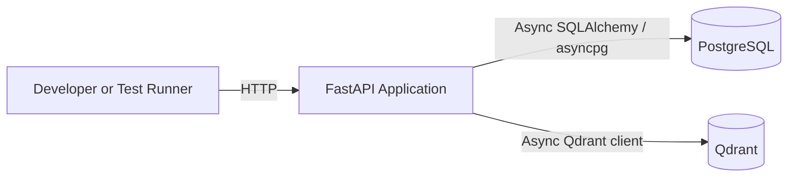
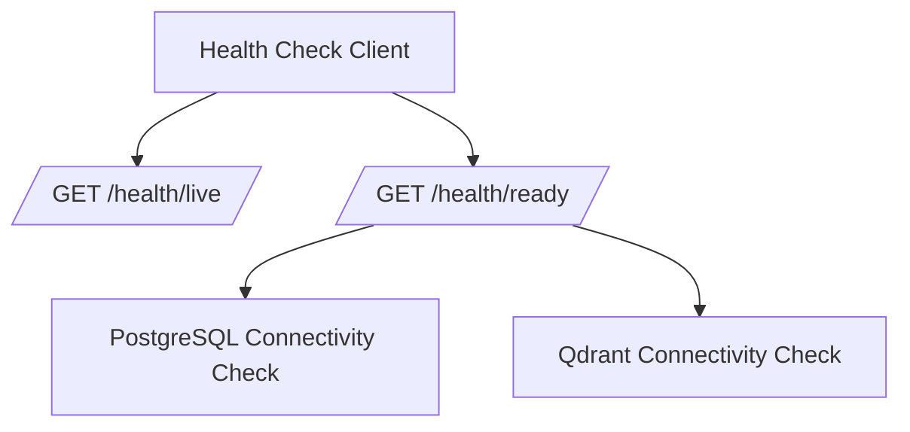
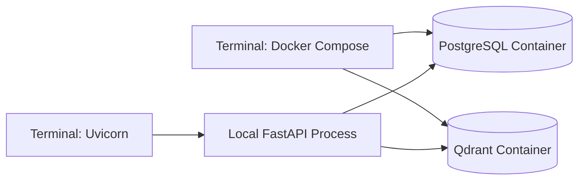
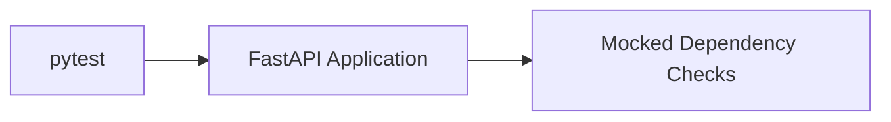
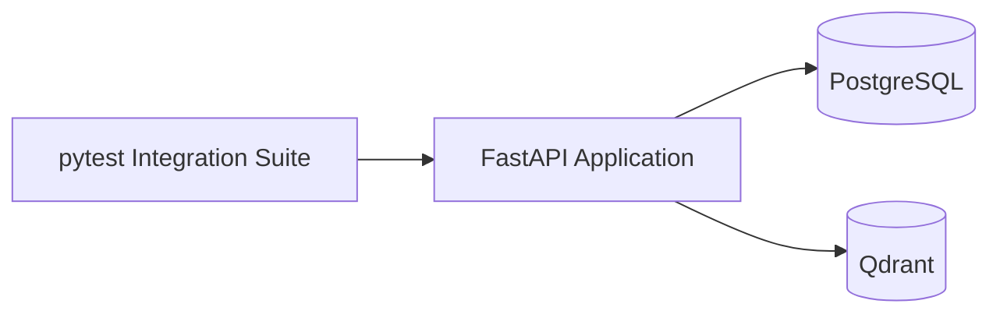
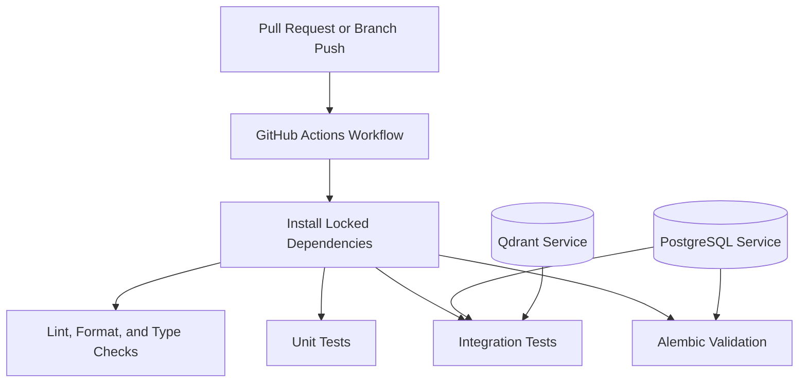
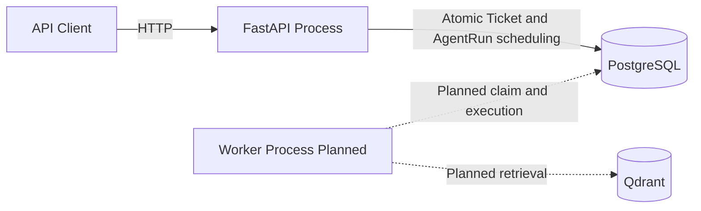

# Runtime Topology

## Purpose

This document describes the intended runtime topology of SupportOps AI Platform for the current foundation, Slice 1 workspace and ticket API, and durable AgentRun scheduling phase, and the planned evolution toward separate API and worker processes.

The current topology is intentionally small. It provides the minimum operational foundation required for reliable local development, testing, and future platform growth without introducing premature distributed infrastructure.

## Current runtime components

The current runtime is designed around three components:

- the FastAPI application process;
- PostgreSQL;
- Qdrant.



The application process is expected to start independently from Docker Compose during the default local development workflow.

Docker Compose is responsible for local infrastructure services:

- PostgreSQL;
- Qdrant.

This separation keeps the application development loop fast while preserving reproducible infrastructure startup.

## FastAPI application process

The FastAPI process owns:

- application construction;
- OpenAPI metadata;
- router composition;
- structured logging setup;
- application startup and shutdown;
- PostgreSQL engine lifecycle;
- Qdrant client lifecycle;
- HTTP request context middleware;
- trace response headers;
- liveness and readiness endpoints;
- versioned `/api/v1` business routes;
- stable expected-error handlers;
- atomic Ticket and initial AgentRun scheduling during ticket intake.

The process is expected to run through Uvicorn.

The application may remain alive when PostgreSQL or Qdrant is unavailable. Dependency availability is represented through readiness rather than process termination.

Invalid required configuration remains a startup error.

Business routes persist and query PostgreSQL. Ticket creation schedules a durable AgentRun in the same application-owned transaction. The API does not claim runs, acquire leases, execute retries, or recover stale ownership. Business routes do not call Qdrant.

## PostgreSQL runtime role

PostgreSQL is the transactional source of truth for the platform.

PostgreSQL currently owns:

- local service provisioning;
- connection configuration;
- async engine initialization;
- process-owned engine and session factory lifecycle;
- connectivity validation;
- Alembic migrations;
- `workspaces` and `tickets` tables;
- `agent_runs` and `agent_run_attempts` tables;
- the workspace ownership foreign key on tickets;
- composite workspace and ticket ownership for AgentRun records;
- uniqueness constraints for workspace slugs and workspace-scoped external references;
- unique initial trigger enforcement for AgentRun scheduling;
- the workspace-leading ticket listing index;
- query-driven indexes reserved for future claim and recovery paths.

Repository operations use request-scoped async sessions for business HTTP routes. The engine and session factory remain process-owned.

Each request receives one async SQLAlchemy session. Route dependencies construct repositories and application services explicitly from that session. Command use cases, including `CreateTicketWithInitialRun`, commit through the application-owned transaction adapter.

Business routes do not call Qdrant. Qdrant remains limited to readiness connectivity checks in the current phase.

Future phases are expected to extend PostgreSQL ownership for:

- worker claim and lease transitions;
- approvals;
- audit records;
- usage events.

## Qdrant runtime role

Qdrant is a rebuildable retrieval index.

During the current phase, Qdrant is used only to establish:

- local service provisioning;
- client configuration;
- client lifecycle;
- connectivity validation.

No collections, vectors, embeddings, ingestion workflows, or retrieval behavior are created.

Qdrant is not involved in workspace, ticket, or AgentRun persistence. Ticket ownership, uniqueness, listing, repository behavior, and AgentRun scheduling are PostgreSQL concerns only.

Future retrieval data must remain reproducible from authoritative source content.

## Application lifecycle

The application lifecycle is explicit.

### Startup

Application startup performs local construction tasks such as:

- loading and validating settings;
- configuring structured logging;
- creating infrastructure clients;
- preparing shared application state.

Client construction does not imply dependency availability.

The application does not require PostgreSQL or Qdrant to be reachable merely to expose liveness and diagnostic readiness behavior.

### Runtime

During runtime:

- liveness verifies that the process is responsive;
- readiness performs bounded connectivity checks;
- API routes use explicitly composed dependencies;
- infrastructure failures are logged without exposing credentials.

Each HTTP request follows this flow:

1. request context middleware generates a request ID and resolves a sanitized correlation ID;
2. the middleware binds context for the request;
3. FastAPI provides a request-scoped async PostgreSQL session;
4. route dependencies construct repositories and application services explicitly;
5. the application use case executes;
6. command use cases open a PostgreSQL transaction through the application-owned adapter;
7. the route maps domain results to response schemas;
8. the middleware attaches `X-Request-ID` and `X-Correlation-ID` response headers;
9. the middleware emits one structured completion event;
10. context is reset in a finally path.

The request context is in-process and task-local.

The engine and session factory are process-owned. Sessions are request-scoped.

Business routes under `/api/v1` schedule durable AgentRun records during ticket intake and do not call Qdrant. Worker claim, lease, retry, and recovery behavior are not operational in the current phase.

### Route versioning

Business routes are versioned:

```text
/api/v1/workspaces
/api/v1/workspaces/{workspace_id}
/api/v1/workspaces/{workspace_id}/tickets
/api/v1/workspaces/{workspace_id}/tickets/{ticket_id}
```

Operational health routes remain unversioned:

```text
GET /health/live
GET /health/ready
```

### Shutdown

Application shutdown releases owned resources:

- the SQLAlchemy async engine is disposed;
- the Qdrant client is closed;
- shutdown failures are logged with exception context.

Lifecycle ownership must remain centralized and predictable.

## HTTP request traceability

HTTP request traceability is handled by middleware in the FastAPI process.

Behavior:

- `X-Request-ID` is always generated by this service;
- inbound `X-Request-ID` is ignored;
- `X-Correlation-ID` is accepted only as a valid UUID;
- invalid or missing correlation values fall back to the request ID;
- route templates are preferred in completion logs;
- concrete unmatched paths are sanitized and bounded;
- unexpected exceptions retain safe `500` behavior and still return trace response headers;
- the middleware does not log request bodies or raw external header values.

Request context is bound for the duration of the request and reset after completion.

## Health topology

The health model separates process health from dependency readiness.



### Liveness

`GET /health/live` verifies that the application process can respond.

It does not call PostgreSQL or Qdrant.

A dependency outage must not cause liveness to fail.

### Readiness

`GET /health/ready` verifies whether required dependencies are available.

The readiness response aggregates:

- PostgreSQL status;
- Qdrant status.

Each dependency check has a bounded timeout.

If any required dependency is unavailable, timed out, or returns an unexpected failure:

- readiness returns a structured unhealthy result;
- the HTTP response uses a non-success status;
- the failing dependency is identified;
- credentials and full connection strings are not returned.

## Local development topology

The default local workflow is:



Expected execution model:

1. install dependencies with `uv`;
2. create a local environment file;
3. start PostgreSQL and Qdrant with Docker Compose;
4. start the FastAPI process with `uv run`;
5. call liveness and readiness endpoints;
6. apply the current Alembic migration head;
7. exercise workspace and ticket routes, including atomic AgentRun scheduling on ticket creation;
8. run local quality and test commands.

The application is not required to run inside Docker Compose for the primary development loop.

## Test topology

### Unit tests

Unit tests run without network services.



Unit tests validate:

- settings behavior;
- application construction;
- request-context creation and cleanup;
- async-task isolation;
- response trace headers;
- correlation propagation and invalid-value fallback;
- incoming request-ID rejection;
- downstream trace-header spoofing prevention;
- request completion logging;
- unexpected exception behavior with retained trace headers;
- liveness;
- readiness aggregation;
- dependency failure responses;
- application service command and query behavior;
- AgentRun domain invariants;
- transactional ticket-intake orchestration;
- workspace and ticket API schemas;
- opaque cursor encoding.

### Integration tests

Integration tests use live PostgreSQL and Qdrant services.



Integration tests validate:

- real PostgreSQL connectivity;
- real Qdrant connectivity;
- readiness success;
- readiness failure;
- Alembic upgrade, downgrade, re-upgrade, and metadata parity;
- workspace repository persistence;
- ticket repository persistence and workspace scoping;
- concurrency-sensitive uniqueness enforcement;
- atomic ticket and AgentRun commit and rollback behavior;
- workspace and ticket HTTP API behavior;
- stable expected-error responses;
- opaque cursor pagination.

## Continuous integration topology

The initial GitHub Actions workflow is expected to use Python 3.12 and dependency installation from the committed lockfile.

The workflow is expected to provide PostgreSQL and Qdrant services for integration validation.



The initial workflow intentionally avoids a runtime matrix because Python 3.12 is the supported platform version.

## Future API and worker topology

A later phase will introduce a separate asynchronous worker process. The worker is planned and is not currently operational.



The API and worker will:

- run as separate operating system processes;
- import the same `supportops` Python package;
- use the same application services and domain model;
- use the same PostgreSQL database;
- use shared infrastructure adapters;
- maintain independent process lifecycle and connection pools.

The API currently persists queued AgentRun records. Claim, lease acquisition, lease-token fencing, retries, stale lease recovery, and graceful worker shutdown remain planned and are not currently operational.

## Process separation implications

When the API and worker become separate processes:

- each process will create and dispose its own database engine;
- each process will own its own Qdrant client where required;
- in-memory state will not be shared;
- configuration will be loaded independently;
- logging context will be process-specific;
- connection pool sizing must account for combined process concurrency;
- graceful shutdown must be implemented independently;
- database state will coordinate durable work;
- process crashes must not lose authoritative workflow state.

Shared Python code does not imply shared runtime memory.

Ticket intake already persists request and correlation identifiers on both the ticket and its initial AgentRun. Future cross-process worker execution will preserve the run correlation identifier while generating a separate execution request identifier for each claimed attempt.

## Failure scenarios

### Invalid configuration

Missing or invalid required configuration prevents application construction.

The failure should be explicit and must not expose secret values.

### PostgreSQL unavailable

Expected behavior:

- the process may start;
- liveness remains healthy;
- PostgreSQL readiness reports unhealthy;
- overall readiness returns a non-success status;
- the failure is logged safely.

### Qdrant unavailable

Expected behavior:

- the process may start;
- liveness remains healthy;
- Qdrant readiness reports unhealthy;
- overall readiness returns a non-success status;
- the failure is logged safely.

### Dependency timeout

A slow dependency check must terminate within the configured health-check timeout.

The readiness response reports the dependency as unhealthy without waiting indefinitely.

### Shutdown failure

A resource cleanup failure must be logged with exception information.

Shutdown handling should continue attempting to release other owned resources where safe.

## Network and security boundaries

The local topology is intended for development and CI.

Trace identifiers support observability and supportability. They do not establish caller identity, authorization, or tenant isolation.

Before public production deployment, the platform will require additional decisions for:

- transport encryption;
- managed secret storage;
- private network boundaries;
- database access restrictions;
- Qdrant authentication and network isolation;
- production process supervision;
- resource limits;
- deployment health probes;
- authentication and authorization;
- tenant isolation;
- backup and recovery;
- centralized telemetry.

These concerns are intentionally outside the current implementation phase.

## Intentionally excluded runtime components

The current topology excludes:

- Redis;
- Celery;
- Kafka;
- SQS;
- EventBridge;
- Langfuse self-hosting;
- OpenTelemetry collectors;
- Prometheus;
- Grafana;
- frontend services;
- Kubernetes;
- cloud load balancers;
- managed cloud databases;
- an operational worker process;
- ingestion workers;
- AI provider calls.

These components will not be introduced until a concrete capability and operational requirement justify them. The API schedules durable AgentRun records, but worker claim, lease, retry, and recovery behavior are not currently operational.
