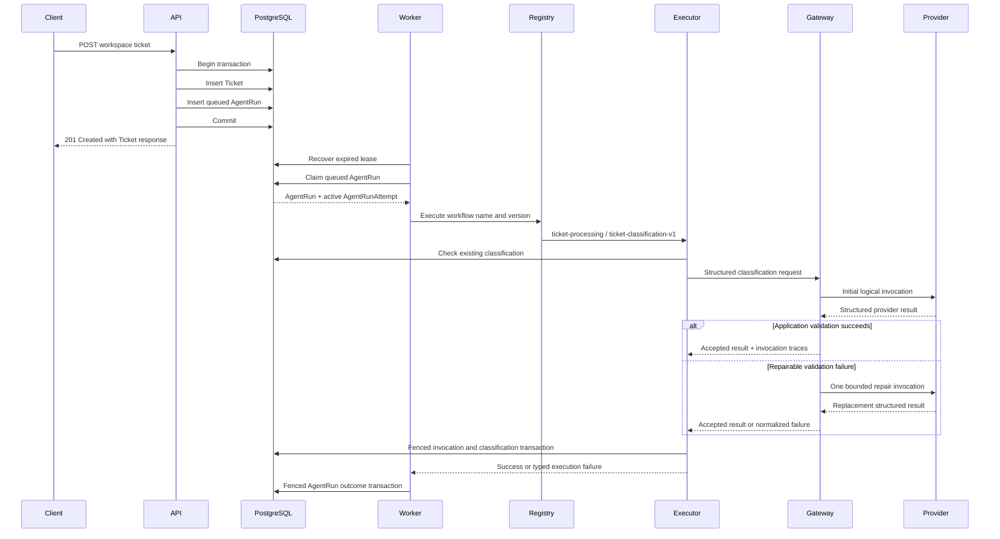

# Durable Ticket Classification

## Purpose

SupportOps AI Platform classifies newly accepted support tickets through a
versioned, durable AgentRun workflow.

The implementation connects the application-owned LLM Gateway to the
PostgreSQL-backed worker while preserving:

- explicit workflow identity;
- provider-independent application contracts;
- short database transactions;
- lease-token fencing;
- retryable and terminal failure semantics;
- immutable classification provenance;
- durable logical invocation history;
- token usage and estimated-cost provenance;
- at-least-once external-call semantics;
- idempotent recovery after classification persistence.

This document describes the implemented `ticket-classification-v1` workflow.
The provider and model remain runtime configuration. The workflow version
remains a durable application contract.

## Current implementation status

The platform currently provides:

- atomic Ticket and initial AgentRun scheduling;
- configured initial workflow-version selection;
- exact workflow and version dispatch;
- deterministic baseline compatibility for historical AgentRuns;
- a process-scoped mock or OpenAI provider;
- a process-scoped application LLM Gateway;
- session-scoped workflow executors and repositories;
- prompt `ticket-classification` version 1;
- registered evaluation prompt `ticket-classification` version 2;
- application-owned Structured Outputs validation;
- bounded validation repair;
- durable `LLMInvocation` records;
- durable accepted `TicketClassification` records;
- provider, model, prompt, schema, token, latency, and cost provenance;
- retryable and terminal LLM failure translation;
- lease-fenced classification persistence;
- idempotent recovery when an accepted classification already exists;
- workspace-scoped classification detail and ticket classification history;
- optional accepted-classification reference in AgentRun inspection;
- AgentRun-scoped logical invocation history;
- a versioned synthetic evaluation dataset;
- a deterministic classification evaluator;
- opt-in mock or OpenAI evaluation execution;
- PostgreSQL integration coverage using the deterministic mock provider.

## End-to-end flow



The HTTP request schedules durable work but does not call the model. Provider
execution occurs only in the separate worker process.

## Scheduling contract

New tickets use the validated setting:

```text
SUPPORTOPS_TICKET_PROCESSING_WORKFLOW_VERSION
```

The local default is:

```text
ticket-classification-v1
```

The initial AgentRun contract is:

```text
workflow_name = ticket-processing
workflow_version = configured value
trigger_key = initial-ticket-processing
status = queued
attempt_count = 0
```

`AgentRun.create_initial()` requires the workflow version explicitly. The domain
factory does not silently choose a current or latest version.

Ticket and AgentRun persistence share one application-owned transaction:

```text
validate workspace
→ insert Ticket
→ insert AgentRun
→ commit both or roll back both
```

A committed ticket therefore has its initial durable processing record. The API
returns the existing Ticket response shape and does not expose classification
state in the creation response.

## Versioned executor dispatch

The worker composes an `AgentRunExecutorRegistry` containing exact
registrations:

```text
ticket-processing / deterministic-baseline-v1
ticket-processing / ticket-classification-v1
```

Dispatch uses only:

```text
workflow_name
workflow_version
```

It does not use:

```text
provider
model
deployment environment
latest version
fallback version
```

An unknown workflow produces a terminal `unsupported_workflow` execution error.
An unknown version for a known workflow produces a terminal
`unsupported_workflow_version` error.

The deterministic baseline remains registered so historical AgentRuns preserve
their original execution semantics. Stored workflow versions are not rewritten
when configuration changes.

## Module responsibilities

### `supportops.modules.agent_runs`

Owns:

- durable workflow identity;
- queue state;
- claim and recovery;
- active attempt identity;
- lease ownership;
- execution timeout;
- retry scheduling;
- terminal run state;
- versioned executor dispatch.

### `supportops.ai`

Owns:

- provider-independent LLM contracts;
- provider adapters;
- prompt definitions and hashes;
- structured output schemas;
- normalized LLM errors;
- bounded validation repair;
- safe logical invocation traces;
- pricing catalog and cost estimation.

### `supportops.modules.ticket_classifications`

Owns:

- durable classification entities;
- durable logical invocation entities;
- classification workflow execution;
- classification idempotency checks;
- conversion from Gateway traces to persistence records;
- classification and invocation persistence;
- lease-fenced classification writes;
- translation from final Gateway failures to AgentRun execution failures;
- workspace-scoped classification and invocation inspection queries;
- classification HTTP inspection routes.

### `supportops.worker`

Owns runtime composition:

- one configured provider per worker process;
- one LLM Gateway per worker process;
- one PostgreSQL engine and session factory per worker process;
- one SQLAlchemy session per worker cycle;
- one session-scoped executor registry per worker cycle;
- provider and engine cleanup during shutdown.

The FastAPI process does not initialize the LLM provider or Gateway.

## Persistence model

## LLMInvocation

`LLMInvocation` stores safe metadata for one logical provider invocation.

Persisted fields include:

```text
id
workspace_id
ticket_id
agent_run_id
agent_run_attempt_id
invocation_sequence
status
provider
model
provider_request_id
prompt_id
prompt_version
prompt_content_hash
schema_version
input_tokens
cached_input_tokens
output_tokens
reasoning_tokens
total_tokens
pricing_catalog_version
pricing_found
estimated_input_cost_usd
estimated_cached_input_cost_usd
estimated_output_cost_usd
estimated_total_cost_usd
latency_ms
error_code
created_at
```

One AgentRun attempt can produce:

```text
one initial logical invocation
+ at most one repair logical invocation
```

Invocation sequences are scoped to an attempt:

```text
UNIQUE (
    agent_run_attempt_id,
    invocation_sequence
)
```

A retry creates a new `AgentRunAttempt`. Its invocation sequence may therefore
restart at `1` without colliding with an earlier attempt.

## TicketClassification

`TicketClassification` stores one immutable accepted structured result for an
AgentRun.

Persisted fields include:

```text
id
workspace_id
ticket_id
agent_run_id
accepted_llm_invocation_id
category
intent
urgency
sentiment
requires_human_review
summary
schema_version
prompt_id
prompt_version
prompt_content_hash
provider
model
created_at
updated_at
```

The accepted classification references the exact successful logical invocation
by UUID:

```text
accepted_llm_invocation_id
```

This is required because invocation sequence alone is not globally unique across
AgentRun retries.

The database enforces:

```text
UNIQUE (agent_run_id)
UNIQUE (accepted_llm_invocation_id)
```

An AgentRun can therefore have at most one accepted classification, and one
invocation cannot be accepted by multiple classifications.

The classification is immutable:

```text
updated_at = created_at
```

A future reinterpretation requires another durable workflow execution rather
than silent mutation of historical provenance.

## Database ownership constraints

PostgreSQL enforces ownership through composite candidate keys and foreign keys.

### AgentRun ownership

```text
UNIQUE (
    workspace_id,
    ticket_id,
    id
)
```

An invocation and classification must match the referenced AgentRun's workspace
and ticket:

```text
llm_invocations(
    workspace_id,
    ticket_id,
    agent_run_id
)
    → agent_runs(
        workspace_id,
        ticket_id,
        id
    )

ticket_classifications(
    workspace_id,
    ticket_id,
    agent_run_id
)
    → agent_runs(
        workspace_id,
        ticket_id,
        id
    )
```

### AgentRunAttempt ownership

```text
UNIQUE (
    agent_run_id,
    id
)
```

An invocation must reference an attempt belonging to the same AgentRun:

```text
llm_invocations(
    agent_run_id,
    agent_run_attempt_id
)
    → agent_run_attempts(
        agent_run_id,
        id
    )
```

### Accepted invocation ownership

```text
UNIQUE (
    agent_run_id,
    id
)
```

A classification must reference an invocation belonging to the same AgentRun:

```text
ticket_classifications(
    agent_run_id,
    accepted_llm_invocation_id
)
    → llm_invocations(
        agent_run_id,
        id
    )
```

These constraints prevent cross-workspace, cross-ticket, cross-run, and
cross-attempt provenance mismatches even if application validation is bypassed.

## Transaction boundaries

Provider calls never execute inside a database transaction.

The worker uses separate short transactions for:

1. expired lease recovery;
2. AgentRun claim and AgentRunAttempt creation;
3. ticket loading;
4. existing-classification lookup;
5. invocation and optional classification persistence;
6. AgentRun success or failure transition.

The external model call runs between the lookup and persistence transactions.

```text
claim transaction commits
→ load ticket transaction commits
→ existing classification lookup commits
→ provider call outside transaction
→ fenced classification persistence commits
→ fenced AgentRun outcome commits
```

This avoids holding database locks or connections while waiting for an external
provider.

## Successful classification

A successful workflow performs:

1. exact workflow and version validation;
2. existing classification lookup;
3. prompt v1 rendering;
4. provider-independent LLM request construction;
5. Gateway execution;
6. application validation;
7. optional bounded repair;
8. invocation trace materialization;
9. cost estimation;
10. accepted classification construction;
11. fenced atomic persistence of invocations and classification;
12. return to the AgentRun processor;
13. fenced AgentRun and attempt completion.

All invocation records and the accepted classification are persisted in one
transaction. The AgentRun lifecycle transition remains a separate transaction
owned by the processor.

## Failure classification

The Gateway normalizes provider and structured-output failures.

Before the executor raises an AgentRun execution error, it attempts to persist
all logical invocation traces under lease fencing.

Examples:

```text
llm_timeout
→ retryable AgentRun failure

llm_rate_limited
→ retryable AgentRun failure

llm_provider_unavailable
→ retryable AgentRun failure

llm_authentication_failed
→ terminal AgentRun failure

llm_quota_exhausted
→ terminal AgentRun failure

llm_invalid_request
→ terminal AgentRun failure

llm_refusal
→ terminal AgentRun failure

llm_output_validation_failed
→ terminal after bounded repair is exhausted
```

The AgentRun processor remains responsible for:

- closing the current attempt;
- retry backoff;
- retry budget exhaustion;
- final failed state;
- clearing or preserving safe error metadata.

Raw SDK exception text is not persisted.

## Lease fencing

Classification persistence requires:

```text
agent_run.status = running
agent_run.lease_token = command lease token
agent_run.lease_expires_at > persistence timestamp
attempt belongs to AgentRun
attempt.lease_token = command lease token
attempt.finished_at IS NULL
attempt.outcome IS NULL
```

The repository locks the active AgentRun and AgentRunAttempt with
`SELECT ... FOR UPDATE`.

A stale worker receives:

```text
lease_lost
```

and cannot persist new invocation or classification records.

Classification persistence fencing and AgentRun outcome fencing are separate
checks because the two commits are intentionally separate transactions.

## Idempotency and crash gaps

## Existing classification check

Before calling the provider, the executor checks for an accepted classification
by workspace and AgentRun.

When one exists:

```text
return workflow success
→ no provider call
→ no additional model cost
```

This supports recovery when the classification committed but the process crashed
before the AgentRun success transition committed.

## Failure invocation replay

Repeated persistence of the same invocation identity and content returns:

```text
already_recorded
```

The repository does not insert a duplicate row.

The same attempt and invocation sequence with different invocation data is an
internal invariant violation and fails visibly.

## Concurrent accepted classification

If another execution commits the accepted classification between the initial
lookup and the fenced write, persistence returns:

```text
already_classified
```

The executor treats the AgentRun as successfully classified.

## External-call delivery semantics

A provider call is an external side effect.

The platform provides:

```text
at-least-once external model invocation
at-most-one accepted classification per AgentRun
```

It does not claim:

```text
exactly-once provider execution
exactly-once provider cost
exactly-once provider billing
```

A process can fail after the provider completes but before invocation and
classification persistence commits. Recovery may repeat the provider call.

A process can also fail after classification persistence commits but before
AgentRun completion commits. In that case, the existing classification prevents
another provider call.

## Retry multiplication

Three distinct retry layers exist:

### Provider transport retry

Owned by the provider SDK adapter.

It addresses transient transport behavior inside one logical invocation.

### Gateway repair

Owned by the application LLM Gateway.

It addresses repairable incomplete or invalid structured output.

The configured limit is application-owned and locally defaults to one repair.

### AgentRun retry

Owned by the durable worker.

It addresses retryable final workflow failures through another
`AgentRunAttempt`.

These layers are independent:

```text
AgentRun attempt
└── initial logical invocation
    ├── provider transport attempts
    └── optional repair logical invocation
        └── provider transport attempts
```

Invocation records represent logical invocations, not SDK transport attempts.

## Prompt and schema provenance

The workflow uses:

```text
prompt_id = ticket-classification
prompt_version = 1
schema_version = ticket-classification-v1
```

Each invocation and classification persists:

- prompt ID;
- prompt version;
- deterministic prompt content hash;
- schema version;
- provider;
- model.

The prompt version does not encode provider, model, schema, workflow, or pricing
catalog version. Those dimensions remain independently queryable.

### Runtime prompt pin versus evaluation registration

Runtime classification remains pinned to prompt version 1 through
`TICKET_CLASSIFICATION_PROMPT_VERSION`. Prompt version 2 is registered for
evaluation and explicit offline selection. Changing the runtime pin is a
separate adoption change. Evaluation registration, static comparison, and an
inconclusive decision do not activate version 2 in production.

## Inspection linkage

Runtime classification produces durable records that inspection projects without
mutating write-path semantics.

Accepted classification detail:

```text
GET /api/v1/workspaces/{workspace_id}/ticket-classifications/{classification_id}
```

Ticket classification history:

```text
GET /api/v1/workspaces/{workspace_id}/tickets/{ticket_id}/classifications
```

AgentRun detail includes an optional minimal accepted-classification reference:

```text
classification = {
  id
  schema_version
  created_at
}
```

or `classification = null` when no accepted classification exists.

AgentRun logical invocation history:

```text
GET /api/v1/workspaces/{workspace_id}/agent-runs/{agent_run_id}/llm-invocations
```

Inspection remains read-only. It exposes safe prompt, provider, model, usage,
estimated-cost, latency, and normalized error provenance. Provider request IDs,
raw prompts, raw responses, lease data, and execution request IDs remain
private.

Inspection and evaluation architecture is documented in
[`classification-evaluation.md`](classification-evaluation.md).

## Evaluation linkage

Offline evaluation reuses the same runtime contracts without sharing
transaction ownership:

- the same prompt ID `ticket-classification`;
- explicit prompt versions 1 and 2 for evaluation selection;
- the same structured output schema `ticket-classification-v1`;
- the same application-owned LLM Gateway;
- the same versioned pricing catalog.

Evaluation does not write to PostgreSQL or Qdrant, does not create AgentRuns,
and does not promote prompts automatically. Dataset cases, prediction
artifacts, deterministic metrics, paired comparison, decision artifacts, and
report provenance remain under the evaluation package and committed `evals/`
artifacts. Runtime remains pinned to version 1 until a separate adoption change.

## Token usage and estimated cost

Each invocation may persist:

- input tokens;
- cached input tokens;
- output tokens;
- reasoning tokens;
- total tokens;
- pricing catalog version;
- pricing lookup result;
- Decimal cost components;
- Decimal total estimated cost.

Unknown token values remain `null`.

Unknown pricing is represented as:

```text
pricing_found = false
estimated costs = null
```

Known mock pricing is represented as explicit Decimal zero when usage is known.

Estimated cost is operational metadata. Provider invoices remain authoritative.

## Runtime lifecycle

The worker creates one process-scoped runtime:

```text
configured provider
+ application LLM Gateway
+ selected model identifier
```

The configured provider is:

```text
mock
or
openai
```

There is no automatic cross-provider fallback.

For each worker cycle:

```text
open AsyncSession
→ create TransactionManager
→ create classification repository
→ create TicketClassificationExecutor
→ create versioned executor registry
→ process cycle
→ close AsyncSession
```

The provider and Gateway are reused across cycles. Session-bound repositories are
not reused across cycles.

During shutdown:

```text
stop worker loop
→ close provider
→ dispose PostgreSQL engine
```

Engine disposal is still attempted when provider cleanup fails.

## Security and privacy

The classification workflow follows these rules:

- API keys use secret types;
- API keys are not logged;
- the API process does not initialize the provider;
- ticket content is untrusted prompt input;
- ticket content is not stored in `LLMInvocation`;
- rendered prompts are not stored;
- raw provider responses are not stored;
- raw SDK exceptions are not stored;
- chain-of-thought is not requested or stored;
- provider request IDs remain internal persistence metadata;
- model output cannot mutate Ticket state;
- classification cannot execute tools;
- classification cannot perform external actions;
- OpenAI failures never select the mock provider.

Workspace scoping enforces data ownership. It does not establish caller identity,
authentication, authorization, or secure multi-tenancy.

## Testing strategy

Unit coverage includes:

- classification and invocation domain invariants;
- domain-to-ORM round trips;
- named constraints and metadata registration;
- migration parity;
- fenced persistence commands;
- repository idempotency behavior;
- exact workflow registry dispatch;
- active-attempt execution context invariants;
- prompt and request construction;
- Gateway success and failure translation;
- initial and repair invocation materialization;
- pricing and usage persistence;
- worker provider lifecycle;
- session-scoped executor composition;
- configured workflow scheduling.

PostgreSQL integration coverage includes:

- migration upgrade and downgrade;
- Ticket and AgentRun atomic scheduling;
- complete mock classification workflow;
- invocation and classification persistence;
- AgentRun and attempt success;
- retryable timeout persistence;
- retry with a new attempt;
- invocation sequence restart per attempt;
- existing-classification recovery without another provider call;
- repeated failure persistence idempotency;
- expired-lease rejection.

Normal tests do not require an OpenAI API key and do not make paid provider
requests.

## Intentionally deferred capabilities

The following capabilities remain intentionally separate:

- separate runtime prompt adoption for version 2;
- provider-backed canonical comparison and production rollout monitoring;
- cross-provider fallback;
- automatic model routing;
- Anthropic provider;
- operational cost dashboards and invoice reconciliation;
- retrieval and RAG;
- RAGAS;
- LangGraph orchestration;
- tool calling;
- human approval workflows;
- Langfuse;
- broader AI observability;
- frontend monitoring.

Durable execution was established first. Read-only inspection and offline
evaluation were then layered on without changing write-path semantics. This
sequencing keeps runtime reliability, persistence semantics, and evaluation
behavior independently reviewable.